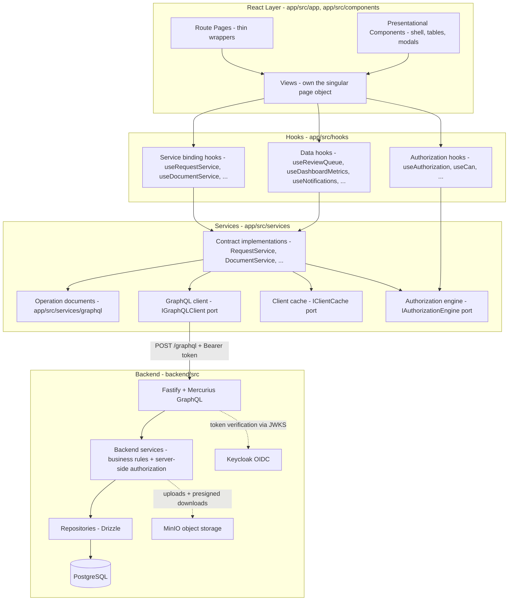
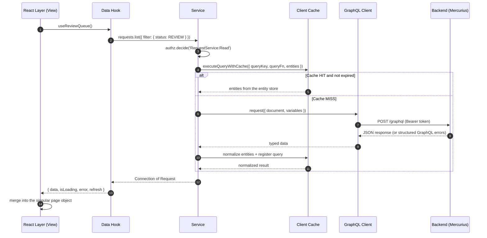

# DocSys Frontend Architecture

> **Scope:** Frontend architecture of the DocSys application under `app/`.
> **Audience:** Engineers building or reviewing routes, views, hooks, services, the cache layer, and the authorization layer.
> **Status:** Target architecture for the frontend restructure. The "Current State and Migration Map" section describes what exists today and what moves.

This document explains the **end-to-end data flow** for a DocSys screen, from the React component tree down to the backend service layer, and the **page philosophy** every route follows when assembling its data.

The single rule that defines the restructure:

```
Backend (GraphQL API)  ->  Services  ->  Hooks  ->  React
```

Each layer has one job, talks only to the layer directly below it, and never reaches across. Components never call GraphQL. Hooks never touch the cache. Services are the only layer that knows the API, the cache policy, and the client-side authorization checks.

For the contract that services implement, see [SERVICE_CONTRACTS.md](./SERVICE_CONTRACTS.md).
For authorization, see [AUTHORIZATION.md](./AUTHORIZATION.md).
For caching, see [CACHE_MANAGER.md](./CACHE_MANAGER.md).

---

## Table of Contents

1. [Layered Architecture Overview](#layered-architecture-overview)
2. [End-to-End Data Flow](#end-to-end-data-flow)
3. [Layer Responsibilities](#layer-responsibilities)
4. [SOLID Across the Layers](#solid-across-the-layers)
5. [Page Philosophy - One Singular Object](#page-philosophy---one-singular-object)
6. [Mutation Pattern - Commit Then Refresh](#mutation-pattern---commit-then-refresh)
7. [Reference Flow: The Review Desk](#reference-flow-the-review-desk)
8. [Current State and Migration Map](#current-state-and-migration-map)
9. [Source Map](#source-map)

---

## Layered Architecture Overview

DocSys is a strict four-layer architecture. The three cross-cutting ports (GraphQL client, client cache, authorization engine) are injected into the service layer; nothing above the service layer sees them.



The key invariants:

1. **Components never touch the cache or GraphQL directly.** Every read and every mutation crosses the same path (Component to Hook to Service to cache and GraphQL client).
2. **Services are the only backend callers.** No `fetch`, no GraphQL document string, no cache key outside `app/src/services/`.
3. **Authorization is checked twice, enforced once.** The backend enforces at the service layer (NFR-07). The frontend engine shapes the UI and fails fast. See [AUTHORIZATION.md](./AUTHORIZATION.md).
4. **Contracts define the seams.** Hooks depend on the interfaces in `app/src/services/contracts/`, never on concrete classes. See [SERVICE_CONTRACTS.md](./SERVICE_CONTRACTS.md).

---

## End-to-End Data Flow

Below is the read path a screen follows when it mounts. Numbers correspond to the sequence diagram.



### Step by step

1. **React layer** renders a route page (for example `/review`). The page renders a view, and the view calls a data hook such as `useReviewQueue()`.
2. **Hook** (`app/src/hooks/*`) holds React state (loading, error, data) and calls service methods through stable references. It contains no business logic and no GraphQL.
3. **Service** (`app/src/services/*.service.ts`) implements its contract. The method:
   - checks authorization through `IAuthorizationEngine` (fail fast, UI consistency),
   - builds a deterministic cache key and calls the shared cache orchestration helper,
   - on a cache miss, executes the GraphQL operation through `IGraphQLClient`,
   - normalizes the response into the entity store and registers the query,
   - normalizes errors into `AppError`.
4. **Cache** (`app/src/services/cache/`) is a normalized entity cache with a query registry. On hit it resolves entities from the store; on miss it stores the normalized result and registers membership indexes for precise invalidation. Full design: [CACHE_MANAGER.md](./CACHE_MANAGER.md).
5. **Backend** is Fastify + Mercurius. Resolvers are thin adapters; business rules and server-side authorization live in the backend service layer, which owns transactions through the Unit of Work and writes to PostgreSQL via Drizzle. Files live in MinIO behind the storage port. Identity is Keycloak; the API verifies the Bearer token per request via JWKS.

The **write path** is identical except for two extra steps: the service calls `authorizeOrThrow` before the mutation, and after the mutation it invalidates the affected cache entries. The view then refreshes (see [Mutation Pattern](#mutation-pattern---commit-then-refresh)).

---

## Layer Responsibilities

### React Layer (Routes, Views, Components)

Routes live in `app/src/app/` (Next.js App Router). Each route is a thin wrapper that renders exactly one view:

```tsx
// app/src/app/review/page.tsx
'use client';

import ReviewView from '@/components/views/ReviewView';

export default function ReviewPage() {
  return <ReviewView />;
}
```

- **Views** (`app/src/components/views/`) own the singular page-data object (see [Page Philosophy](#page-philosophy---one-singular-object)). A view calls hooks, merges their results into one object, and renders children from it.
- **Components** (`app/src/components/`) are presentational. They receive data via props, emit events via callbacks, and never read the cache or call services. Modals (`NewIntakeModal`, `DocumentDetailModal`, `EventModal`, `RoutingSlipModal`, `OfficialWordDocument`) follow the same rule; the owning view decides what happens on submit.
- Route pages stay thin so navigation and code splitting stay predictable. `app/src/app/layout.tsx` mounts the global shell (`AppLayout`): masthead, header, sidebar, footer, and the global modals.
- **No data fetching in components.** If a component needs data, the view fetches it and passes it down.

### Hooks

Located in `app/src/hooks/`.

- **Service binding hooks** (`useRequestService()`, `useDocumentService()`, and so on) expose stable method references picked from the contract. They are built on a shared `useServiceMethods` helper so every method identity is stable across renders and `useEffect` dependency arrays do not churn. Adding a method to a hook is a one-line change to its name list.
- **Data hooks** (`useReviewQueue()`, `useDashboardMetrics()`, `useRequest(id)`, `useNotifications()`, ...) own React state for one screen concern: `{ data, isLoading, error, refresh }`. They guard against out-of-order responses and clean up on unmount.
- **Authorization hooks** (`useAuthorization()`, `useCan(action, resource?)`, `usePermissions()`) expose the engine to React. They re-render consumers when the session subject changes.
- Hooks never call GraphQL, never compute cache keys, and never evaluate wildcard permission strings by hand. They call services and read the engine.
- Hooks translate `AppError` into user-facing state; `error.message` is safe to render directly.

### Services

Located in `app/src/services/`.

- One service per domain aggregate: `RequestService`, `DocumentService`, `AttachmentService`, `EventService`, `VenueService`, `NotificationService`, `UserService`, `RoleService`, `ReportService`, `LookupService`, plus `SessionService`.
- Services are the only layer that:
  - holds GraphQL operation documents (`app/src/services/graphql/`),
  - generates cache keys and orchestrates cache-aside reads,
  - invalidates cache entries after mutations,
  - calls `authorizeOrThrow(action, resource)` before executing,
  - normalizes errors into `AppError` (stable code plus user-safe message).
- Services implement the contracts in `app/src/services/contracts/` and are constructed at the composition root with their ports injected (`IGraphQLClient`, `IClientCache`, `IAuthorizationEngine`).
- Services are consumed **only** by hooks and by the composition root. Views and components never import a service class.

### Cross-Cutting Ports

| Port                 | Contract               | Implementation                        | Used by           |
| -------------------- | ---------------------- | ------------------------------------- | ----------------- |
| GraphQL transport    | `IGraphQLClient`       | `services/graphql/client.ts` (fetch)  | Services          |
| Client cache         | `IClientCache`         | `services/cache/client-cache.ts`      | Services          |
| Authorization engine | `IAuthorizationEngine` | `authz/engine.ts` + `authz/policy.ts` | Services + hooks  |
| Session (OIDC)       | `ISessionService`      | `services/session/session.service.ts` | Composition root  |

The session service hydrates the authorization engine from the backend `me` query. The GraphQL client reads the access token through the session service. The cache never talks to either.

### Backend

- GraphQL API: Fastify + Mercurius at `/graphql` (SDL modules under `backend/src/graphql/`).
- Business logic: backend services under `backend/src/services/`, with repository contracts under `backend/src/interfaces/` and a Unit of Work owning transactions.
- Authorization: enforced server-side at the backend service layer (NFR-07). Client-side hiding of controls is not a security control.
- Identity: Keycloak (OIDC). The API verifies Bearer tokens via JWKS per request; users are shadow records keyed by the Keycloak `sub` claim.
- Storage: MinIO. Uploads are multipart REST routes; downloads are short-lived presigned URLs requested through GraphQL.

---

## SOLID Across the Layers

The restructure is judged against these mappings. Each row names the layer, the principle, and the concrete mechanism that satisfies it.

| Layer    | Principle | Mechanism |
| -------- | --------- | --------- |
| React    | S         | Views assemble and render one page object; components render props only; route pages are one-liners. |
| React    | O         | New screens are added as new views plus hooks; existing components are reused, not modified. |
| Hooks    | D         | Hooks depend on `ServiceRegistry` (contract types), never on concrete classes. |
| Hooks    | I         | Each hook picks the narrow method list it needs; no god-service surface is exposed to a view. |
| Services | S         | One service per aggregate; GraphQL documents, cache keys, authz checks, and error normalization each have one home. |
| Services | O         | New domains are added as a new contract plus implementation; shared cache helpers and error normalization are reused, not copied. |
| Services | L         | Any implementation of `IRequestService` (real, mock, fixture) behaves the same for its callers; tests swap implementations without touching hooks. |
| Services | D         | Services receive `IGraphQLClient`, `IClientCache`, and `IAuthorizationEngine` through constructor injection; the composition root wires concretes. |
| Authz    | S         | The engine decides; the policy module declares rules; the session service fetches subject attributes. |
| Authz    | O         | New actions add rows to the policy table without modifying the engine. |
| Backend  | S/O/L/I/D | Resolvers are thin adapters (SRP), domains extend the schema via modules (OCP), services depend on repository interfaces (DIP), and contracts stay focused per repository (ISP). |

---

## Page Philosophy - One Singular Object

Every DocSys view assembles **one singular page-data object** that mirrors the shape of what the screen shows. The view renders exclusively from that object. Mutations are committed by invalidating and refetching, never by patching the object in place beyond the active edit buffer.

### Why one object?

1. **Single source of truth.** The review desk does not reconcile requests from one hook and documents from another that overlap. It reads one tree: `{ queue, activeDocument, lookups }`.
2. **Cache-friendly.** Each fetch writes to the same normalized entity store, so re-initialization is cheap. Only queries whose underlying data changed re-execute.
3. **Predictable states.** A view has exactly three page states: `idle`, `loading`, `error`, or the resolved object. No mid-render half-states from staggered fetches.
4. **Schema-shaped.** The object mirrors the GraphQL schema, so navigation, diffing, and serialization are mechanical:

```
Request
├── id, controlNo, title, status, priority
├── slaDeadline, receivedAt
├── attachments: RequestAttachment[]
├── documents: Document[]
│   ├── status, controlNo, title
│   ├── attachments: DocumentAttachment[]
│   └── transmissions: Transmission[]
└── logs: DocumentLog[]
```

### Loading lifecycle

```
idle          -> view mounts, no fetch yet
loading       -> initializePageData() in flight
{ ... }       -> singular object resolved, view renders
error         -> a fetch failed; view renders an error panel
```

The fetch is owned by a single `useCallback` (`initializePageData`) that the view calls from `useEffect` on mount and from each mutation's success handler.

### What a view may hold outside the singular object

Local UI state that is not server-derived:

- The currently active tab or filter panel state.
- Search input and filter selections (before they are pushed into hook args).
- Form buffers (an in-progress decision note, a denial reason) until the mutation commits.
- Modal open/closed flags and the currently selected row.
- Sidebar collapse state.

These never leak into the singular object. The object always reflects the server's view.

---

## Mutation Pattern - Commit Then Refresh

Mutations are **commit then refresh**, not optimistic in-place patches:

1. The view calls a service method through a hook (for example `documents.review({ documentId, decision: 'APPROVED' })`).
2. The service checks authorization (`DocumentService:Review` plus the resource guards), issues the GraphQL mutation, then **invalidates the affected cache entries**: the document, its request, and the query types that reference them (queues, dashboard metrics).
3. The view calls `initializePageData()` again. Invalidation already pruned the right cache entries, so the refetch only re-queries what changed.
4. The singular page-data object is replaced and React re-renders from the new state.

### Why refresh instead of patching?

- The cache is the source of truth for "what the server has". A local patch would diverge from it, and the next refresh would look like a glitch.
- Invalidation is targeted. Entities that did not change resolve from the same entity-store slot with stable references, so React's diffing keeps re-renders small.
- It removes a class of bugs where one screen shows a stale relationship (a document approved on the review desk still pending on the dashboard).

---

## Reference Flow: The Review Desk

The review desk (`/review`) exercises every layer, so it is the canonical example for new screens:

1. `ReviewView` calls `useReviewQueue()` and `useLookups()`; it merges results into `pageData = { queue, lookups, activeDocument }`.
2. `useReviewQueue()` calls `requests.list({ filter: { status: 'REVIEW' } })` and `documents.list({ filter: { status: 'UNDER_REVIEW' } })` through the service binding hook. The cache deduplicates entities that appear in both.
3. The view renders one queue row per request. Each row shows the request, its linked documents, and SLA state derived from `slaDeadline`.
4. The decision panel calls `documents.review(...)` on Approve, Endorse, or Deny. Denial requires a written reason (FR-23); the form enforces it before the call.
5. On success, the service invalidates the document, its request, and the queue queries. The view reinitializes; the queue reflects the new status.
6. Buttons render only when `useCan('DocumentService:Review', resource)` allows the action, and the engine additionally guards on the document's status (only `UNDER_REVIEW` documents can be decided).

When extending DocSys, model new screens after this flow: one fetch orchestrator, one singular object, mutations that reinitialize.

---

## Current State and Migration Map

The current prototype runs on a monolithic context and a localStorage repository. The restructure replaces that with the layered architecture above. The migration is file-scoped:

| Current file                          | Target                                                        |
| ------------------------------------- | ------------------------------------------------------------- |
| `app/src/context/AppContext.tsx`      | Split into `SessionProvider` (OIDC + `me`), `AuthorizationProvider` (engine hydration), and per-screen data hooks. Global document/event/audit arrays are retired in favor of hooks backed by services. |
| `app/src/lib/repository.ts`           | Retired. Replaced by contract services plus the GraphQL client. The localStorage persistence and the optional REST sync path are removed. |
| `app/src/lib/cleanData.ts`            | Becomes dev fixtures under `app/src/services/mocks/`, used only by mock service implementations when running without a backend. |
| `app/src/lib/data.ts`                 | Label maps and static constants move to `app/src/lib/constants.ts`. `INITIAL_DOCUMENTS` / `INITIAL_EVENTS` / `INITIAL_AUDIT_LOGS` become fixtures. |
| `app/src/lib/searchEngine.ts`         | Client-side scoring retires. Search and filtering move to backend query args (`search`, `filter`, `sort`). Keep only pure display helpers if a view needs them. |
| `app/src/lib/types.ts`                | Superseded by the schema-mirrored models in `app/src/services/contracts/models.ts`. UI-only view-model types stay next to their view. |
| `app/src/app/*/page.tsx`              | Unchanged shape: thin page renders one view. |
| `app/src/components/views/*`          | Views are rewired to hooks; they stop reading `useApp()` directly. |
| `app/src/app/login/page.tsx`          | Replaced by the Keycloak OIDC flow through `ISessionService`. The persona switcher is removed; roles come from the backend. |
| `app/src/components/Sidebar.tsx`      | Counts derive from data hooks; nav items gate on `useCan` where the backend gates the underlying reads. |
| `app/src/components/DocumentDetailModal.tsx` | Receives its document via props from the owning view; mutations call the service through a hook and refresh the view on success. |

Migration order:

1. Approve [SERVICE_CONTRACTS.md](./SERVICE_CONTRACTS.md).
2. Implement the cross-cutting ports: GraphQL client, session service, authorization engine, client cache.
3. Implement contract services in domain order: session and authz first, then `LookupService`, `RequestService`, `DocumentService`, `AttachmentService`, then booking (`VenueService`, `EventService`), then `NotificationService`, `UserService`, `RoleService`, `ReportService`.
4. Add hooks per screen and rewire views one route at a time: `/dashboard`, `/incoming`, `/review`, `/prepare`, `/transmit`, `/schedule`, `/archive`, `/reports`, `/admin`, `/login`.
5. Retire `AppContext`, `repository.ts`, and the fixture data paths. Keep mock implementations for tests.

---

## Source Map

| Layer         | Location                      | Notes                                             |
| ------------- | ----------------------------- | ------------------------------------------------- |
| Routes        | `app/src/app/`                | App Router pages; thin wrappers                   |
| Views         | `app/src/components/views/`   | Own the singular page object                      |
| Components    | `app/src/components/`         | Presentational; shell, tables, modals             |
| Hooks         | `app/src/hooks/`              | React bindings; stable service handles            |
| Contracts     | `app/src/services/contracts/` | Interfaces and schema-mirrored types only         |
| Services      | `app/src/services/`           | Contract implementations; GraphQL, cache, authz   |
| GraphQL ops   | `app/src/services/graphql/`   | Query and mutation documents per domain           |
| Cache         | `app/src/services/cache/`     | Normalized entity cache implementation            |
| Authorization | `app/src/authz/`              | Engine, policy table, provider                    |
| Session       | `app/src/services/session/`   | Keycloak OIDC flow and `me` bootstrap             |
| Composition   | `app/src/providers/`          | Wires ports and services into the React tree      |
| Backend       | `backend/src/`                | Fastify + Mercurius, services, Drizzle, ports     |

See also:

- [SERVICE_CONTRACTS.md](./SERVICE_CONTRACTS.md) - the contract this architecture depends on.
- [DOCUMENT_WORKFLOW.md](./DOCUMENT_WORKFLOW.md) - the six-step workflow and the frontend calls per step.
- [AUTHORIZATION.md](./AUTHORIZATION.md) - ABAC model and the backend permission source.
- [CACHE_MANAGER.md](./CACHE_MANAGER.md) - cache stores, keys, and CRUD flows.
- [specs/services-spec.md](./specs/services-spec.md) - service implementation spec.
- [specs/hooks-spec.md](./specs/hooks-spec.md) - hooks implementation spec.
- [specs/authz-spec.md](./specs/authz-spec.md) - authorization implementation spec.
- [ROUTING.md](./ROUTING.md) - route matrix and App Router conventions.
- [COMPONENTS.md](./COMPONENTS.md) - component inventory and conventions.
- [STYLING.md](./STYLING.md) - Tailwind v4 and the civic design tokens.
- [SETUP.md](./SETUP.md) - running the app, the backend, and local infrastructure.
