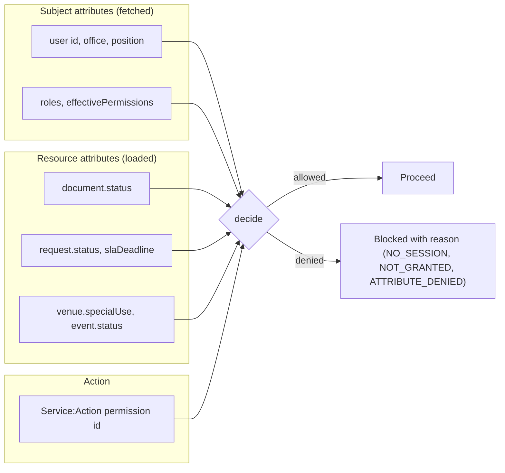

# Authorization

> **Scope:** Client-side authorization for DocSys. Single-layer, attribute-based (ABAC). No hardcoded roles, no hardcoded permissions, no role-to-permission tables in the frontend.
> **Audience:** Engineers implementing or auditing access control in services, hooks, and views.

This document explains how DocSys shapes the UI around authorization and how the frontend decides what a user may attempt. The authoritative enforcement happens on the backend: every service-layer action enforces its `Service:Action` permission server-side (FR-05, NFR-07). Client-side hiding of controls is not a security control; it exists for clarity and fail-fast feedback.

For the contract types, see [SERVICE_CONTRACTS.md](./SERVICE_CONTRACTS.md). For the implementation spec, see [specs/authz-spec.md](./specs/authz-spec.md).

---

## Table of Contents

1. [What Changed From the Old Design](#what-changed-from-the-old-design)
2. [The Permission Source: the `me` Query](#the-permission-source-the-me-query)
3. [Wildcard Semantics](#wildcard-semantics)
4. [The ABAC Model](#the-abac-model)
5. [Policy Rules](#policy-rules)
6. [The Engine](#the-engine)
7. [Integration in Services](#integration-in-services)
8. [React Integration](#react-integration)
9. [Permission Catalog and Typing](#permission-catalog-and-typing)
10. [Source Map](#source-map)

---

## What Changed From the Old Design

The previous design (inherited from another project) had two frontend layers with everything hardcoded:

| Old design                                        | DocSys design                                                        |
| ------------------------------------------------- | -------------------------------------------------------------------- |
| RBAC layer with a hardcoded role-to-permission map (`roles.js`) | No local role-to-permission map. Grants are fetched from the backend. |
| Hardcoded permission constants (`permissions.js`) used as grants  | Permissions arrive at runtime via `me.effectivePermissions`. The frontend only names actions for checks; it never grants them. |
| ABAC as a second layer of parameter expression trees | One ABAC layer: subject attributes (fetched) plus resource attributes (loaded) drive every decision. |
| Frontend treated as a guard against obvious misuse | Frontend shapes the UI and fails fast; the backend enforces (NFR-07). |

Two rules follow from this and are non-negotiable in code review:

1. **No file in `app/src/` may contain a role name mapped to a permission list.** Roles exist only as display and audit data inside the fetched subject.
2. **No file in `app/src/` may declare which permissions exist.** The `KnownActionId` union mirrors the backend for type safety; it is generated and validated, never used as a grant source.

---

## The Permission Source: the `me` Query

Permissions are returned by the backend from a specific GraphQL endpoint: the `me` query, resolved from the authenticated Keycloak token. This is the session bootstrap call. No permission logic runs before it completes.

```graphql
query SessionBootstrap {
  me {
    id
    firstName
    middleName
    lastName
    suffix
    email
    contactNo
    office
    position
    roles {
      id
      name
      description
      permissionPayload
    }
    effectivePermissions
  }
}
```

What each field provides:

| Field                        | Role in authorization                                        |
| ---------------------------- | ------------------------------------------------------------ |
| `roles[].permissionPayload`  | The per-role payloads, kept for the admin UI and for showing where a grant comes from. |
| `effectivePermissions`       | The union of all role payloads, wildcards included (FR-05). This is the grant set the engine evaluates against. |
| `office`, `position`         | Subject attributes available to policy guards.               |
| `id`                         | Subject identity; ties audit entries to the actor.           |

The session service loads this once after login, builds the `AuthzSubject`, and hands it to the engine. On token refresh or role changes, the service reloads and the engine is rehydrated.

### The `permissionCatalog` query

The backend also exposes `permissionCatalog`: the static catalog of every `Service:Action` defined in backend code (NFR-21). It is used by admin screens (role editors) and by the contract drift check. It is **not** a grant source; it says what actions exist, not who holds them.

```graphql
query PermissionCatalog {
  permissionCatalog {
    service
    actions
  }
}
```

---

## Wildcard Semantics

Grants support `*` wildcards at both levels, with the same rules the backend applies (`permissionSatisfies` in `backend/src/types/permissions.ts`):

| Permission string    | Meaning                                       |
| -------------------- | --------------------------------------------- |
| `DocumentService:Review` | The specific action                       |
| `DocumentService:*`  | Every action in the DocumentService domain    |
| `*:*`                | Every action everywhere                       |
| `*:Review`           | The `Review` action in every service          |

The engine's grant check must implement exactly this algorithm:

```ts
export function permissionSatisfies(
  granted: readonly string[],
  required: string,
): boolean {
  const [reqService, reqAction] = required.split(':');
  return granted.some((grant) => {
    if (grant === '*:*') return true;
    const [gService, gAction] = grant.split(':');
    if (gService !== reqService && gService !== '*') return false;
    return gAction === '*' || gAction === reqAction;
  });
}
```

One implementation, used by both `decide()` and `can()`. Do not reimplement this per service.

---

## The ABAC Model

A decision combines four attribute classes:



The decision runs two checks in order:

1. **Grant check (dynamic).** Does `effectivePermissions` satisfy the action, wildcards included? This answers "may this user attempt this operation at all". The data comes from the backend; the frontend holds no list.
2. **Attribute guard (declarative).** Do the resource and subject attributes satisfy the policy rules for this action? For example, only a document in `UNDER_REVIEW` may be reviewed, and only special-use venues require the elevated booking permission.

Deny behavior is fail-closed:

- No subject loaded (session pending) returns `NO_SESSION` with the reason "Your session is still loading." and blocks the action.
- A missing grant returns `NOT_GRANTED`.
- A failed attribute guard returns `ATTRIBUTE_DENIED` with the rule's user-safe reason.
- An action with no policy rules and a passing grant is allowed.

---

## Policy Rules

Rules are declarative rows in one module (`app/src/authz/policy.ts`). Each row names an action and, optionally, a guard over the request context. Adding a rule never touches the engine.

The DocSys rules, grounded in the requirements:

| Action | Guard (resource attribute condition) | Source |
| ------ | ------------------------------------ | ------ |
| `RequestService:Encode` | none (creation) | FR-07 |
| `RequestService:Screen` | `request.status === 'RECEIVED'` | FR-12 |
| `DocumentService:Prepare` | creation passes without a resource; submit path requires `document.status === 'DRAFTING'` | FR-16, FR-21 |
| `DocumentService:Review` | `document.status === 'UNDER_REVIEW'` | FR-21, FR-22 |
| `DocumentService:Sign` | `document.status` in `APPROVED` or `ENDORSED`, and `document.signatoryRequired === true` | FR-25 |
| `DocumentService:Transmit` | `document.status` in `APPROVED`, `ENDORSED`, or `SIGNED` | FR-26..28 |
| `DocumentService:Close` | `request.status` in `APPROVED`, `ENDORSED`, `DENIED`, or `TRANSMITTED` | FR-30 |
| `EventService:Create` | none; when `venue.specialUse === true`, the action additionally requires the `EventService:BookSpecialVenue` grant | FR-41 |
| `EventService:Update` | `event.status !== 'CANCELLED'`; special-use venue condition applies as above | FR-41 |
| `EventService:Cancel` | `event.status !== 'CANCELLED'` | FR-41 |
| `UserService:Deactivate` | `user.id !== subject.userId` (no self-deactivation) | FR-03 |
| All other actions | no attribute guard; the grant check alone decides | |

Guard shape:

```ts
// app/src/authz/policy.ts (shape, not the full file)

export interface AuthzContext {
  subject: AuthzSubject;
  resource?: AuthzResource | null;
  action: ActionId;
}

export interface ActionRule {
  action: ActionId;
  /** Return true to allow, false to deny. Omitted = grant check only. */
  guard?: (ctx: AuthzContext) => boolean;
  /** User-safe reason shown when the guard denies. */
  reason?: string;
  /** Extra grants required when a resource attribute condition holds. */
  requiresWhen?: (ctx: AuthzContext) => ActionId[];
}
```

Notes:

- Guards read `resource.attributes` (the loaded entity) and `subject` only. They never call services or fetch data.
- A guard that cannot evaluate (missing resource for an action that needs one) denies with `ATTRIBUTE_DENIED`.
- The frontend rules mirror the backend state machine. When they disagree, the backend wins and the frontend rule is corrected. The backend remains the enforcement authority.

---

## The Engine

The engine (`IAuthorizationEngine` in [SERVICE_CONTRACTS.md](./SERVICE_CONTRACTS.md), implemented in `app/src/authz/engine.ts`) exposes:

| Member                        | Purpose                                                            |
| ----------------------------- | ------------------------------------------------------------------ |
| `isHydrated()`                | True once the subject is loaded from `me`.                          |
| `getSubject()`                | The current subject (null before bootstrap, after logout).          |
| `getPermissions()` / `getRoles()` | Raw fetched values for display and debugging.                  |
| `decide({ action, resource })`| Full ABAC decision: `{ allowed, reason?, code? }`.                  |
| `can(action, resource?)`      | Boolean convenience over `decide()`.                                |
| `setSubject(subject)`         | Rehydrate on login, refresh, role change, or logout (`null`).       |
| `subscribe(listener)`         | Subject change notifications; the React provider re-renders on them. |

One engine instance is created at the composition root and shared by every service and hook. It holds no state beyond the current subject.

---

## Integration in Services

Every service method that touches the backend checks authorization first. Mutations additionally pass the resource they operate on:

```ts
// inside DocumentService.review(input)
const document = await this.getById(input.documentId);

this.authz.decide({
  action: 'DocumentService:Review',
  resource: { kind: 'document', attributes: { status: document?.status } },
});

if (input.decision === 'DENIED' && !input.denialReason?.trim()) {
  throw new AppError('VALIDATION', 'A denial must state written grounds.');
}

// ... execute the mutation, invalidate cache entries
```

Rules of integration:

- The check happens **before** any cache read or network call (fail fast, no wasted round trips).
- The check throws `AppError` with `code: 'FORBIDDEN'` and the decision's `reason` as the message. Hooks surface it; views never rephrase it.
- Reads use `decide()` with `resource: null` unless the read is scoped to a specific entity.
- Session bootstrap operations are the only ungated calls: `me`, `permissionCatalog`, and the OIDC token exchange.
- Lookup reads gate under the consuming domain's read action (see [specs/services-spec.md](./specs/services-spec.md)).

---

## React Integration

The provider (`app/src/authz/provider.tsx`) hydrates the engine from the session and re-renders consumers on subject changes. Hooks live in `app/src/hooks/`.

| Hook | Returns |
| ---- | ------- |
| `useAuthorization()` | `{ can, decide, permissions, roles, user, isHydrated }` |
| `useCan(action, resource?)` | `boolean`, memoized per action and resource attributes |
| `usePermissions()` | The fetched `effectivePermissions` array (display only) |
| `useSessionUser()` | The current session user (name, office, position, roles) |

### Hiding a control

```tsx
import { useCan } from '@/hooks/useCan';

function DecisionPanel({ document }: { document: Document }) {
  const canReview = useCan('DocumentService:Review', {
    kind: 'document',
    attributes: { status: document.status },
  });

  if (!canReview) return null;

  return <ReviewActions document={document} />;
}
```

### Disabling instead of hiding

For controls that should stay visible with an explanation, use `decide()`:

```tsx
const decision = decide('EventService:Create', {
  kind: 'event',
  attributes: { venueSpecialUse: venue.specialUse },
});

<button disabled={!decision.allowed} title={decision.reason}>
  Schedule Venue
</button>
```

Two conventions:

- Gate on the **most specific resource you have**. A queue row gates on the document it renders, not on the list query.
- Never compute permission logic in a component. If a view needs a derived flag, it comes from a hook or a memo over `can`/`decide`.

---

## Permission Catalog and Typing

The frontend uses permission ids as strings. Two safety nets keep them honest without turning into a grant source:

1. **`KnownActionId` union** (in `app/src/services/contracts/authz.ts`) is generated from `backend/src/types/permissions.ts`. Checks written against it fail to compile if the backend renames an action.
2. **CI drift check.** A script fetches `permissionCatalog` (or diffs against the backend constants file) and fails when the union and the backend disagree.

Neither mechanism grants anything. Grants exist only in `me.effectivePermissions` at runtime.

---

## Source Map

| File                                  | Purpose                                                    |
| ------------------------------------- | ---------------------------------------------------------- |
| `app/src/services/contracts/authz.ts` | Contract: engine interface, subject/resource/decision types, `KnownActionId` |
| `app/src/authz/engine.ts`             | Engine implementation: grant check, policy evaluation, subscriptions |
| `app/src/authz/policy.ts`             | Declarative rule table (the table above, as code)          |
| `app/src/authz/provider.tsx`          | Hydrates the engine from the session; React context        |
| `app/src/hooks/useAuthorization.ts`   | `useAuthorization`, `useCan`, `usePermissions`, `useSessionUser` |
| `app/src/services/session/`           | Loads `me` and builds the subject                          |

See also:

- [SERVICE_CONTRACTS.md](./SERVICE_CONTRACTS.md) - `IAuthorizationEngine`, `AuthzSubject`, `AuthzDecision`.
- [specs/authz-spec.md](./specs/authz-spec.md) - engine, policy, and test implementation spec.
- [ARCHITECTURE.md](./ARCHITECTURE.md) - where authorization sits in the four-layer chain.
