# Document Workflow - Frontend Solution

> **Scope:** How the frontend (`app/`) solves the six-step document workflow. Frontend only; backend internals are not described. Where the backend does not cover a capability yet, the step says so explicitly.
> **Audience:** Engineers wiring the workflow screens to the service layer, and reviewers checking step coverage.

The workflow follows the requirements (FR-07..FR-31 in `backend/requirements.txt`):

```
Step 1 Reception  ->  Step 2 Screening  ->  Step 3 Preparation  ->  Step 4 Review & Approval  ->  Step 5 Transmission  ->  Step 6 Completion & Archiving
```



```mermaid
flowchart LR
    S1["Step 1 Reception"] -->|"encodeRequest"| S2["Step 2 Screening"]
    S2 -->|"screenRequest / resubmitRequest"| S3["Step 3 Preparation"]
    S3 -->|"prepareDocument + submitDocumentForReview"| S4["Step 4 Review & Approval"]
    S4 -->|"reviewDocument / signDocument"| S5["Step 5 Transmission"]
    S5 -->|"transmitDocument"| S6["Step 6 Completion & Archiving"]
    S6 -->|"closeRequest"| A["Archive (read-only)"]
```

## How the frontend solves a step

Every step follows the same layered path (see [ARCHITECTURE.md](./ARCHITECTURE.md)):

```
View (screen)  ->  Hook (state)  ->  Service use-case  ->  GraphQL operation  ->  return value  ->  UI update
```

- The view never calls the API. It calls a hook.
- The hook calls a service use-case (from [SERVICE_CONTRACTS.md](./SERVICE_CONTRACTS.md)); the use-case name is written as `service.method` (for example `requests.encode`).
- The service checks authorization (ABAC), executes the GraphQL operation of the same intent (for example `encodeRequest`), invalidates the affected cache entries, and returns the normalized entity.
- The hook exposes `{ data, isLoading, error, refresh }`; the view renders from it.
- Mutations are commit-then-refresh: after a successful call, the view calls `refresh()` and the queue reflects the new state.

Every mutation below is reached the same way. Steps that need file bytes (scans, drafts, proofs, signed finals) upload through `attachments.*`, which POST multipart to the REST upload routes; everything else is GraphQL.

---

## Step 1: Reception and Intake

**Actor:** Clerk/Encoder (Central Receiving Desk).
**Screen:** `/incoming`; "Log New Incoming" opens the intake wizard (`NewIntakeModal`, three panels: metadata, scanner/upload, checklist).

Clerk/Encoder receives the incoming request and logs it. The frontend calls:

- `requests.encode(input)` -> `encodeRequest` mutation

Input: `requestTypeId`, `title`, `requestingParty`, `originOffice`, `channel` (`WALK_IN` | `MAIL` | `COURIER` | `EMAIL`), `priority`, `receivedAt`.

It returns the created `Request`:

```ts
{
  id, controlNo: 'TO-2026-0045',   // issued by the backend, unique per type and year
  status: 'RECEIVED',
  receivedAt, slaDeadline,          // received_at + 3 business days (RA 11032)
  createdBy,
}
```

Then the scanned letter and each annex are uploaded:

- `attachments.uploadRequestAttachment({ requestId, kind, file })` -> multipart `POST /uploads/requests/:requestId`
- Returns `RequestAttachment { id, kind, originalName, mimeType, sizeBytes, checksum }`

**UI update:** the wizard closes; the reception queue refreshes and the new row appears with its control number, annex count, and SLA deadline. The scanner (`DocumentScanner`) captures pages in the browser; the frontend only uploads files, it never generates content.

**Authorization:** `RequestService:Encode`, `AttachmentService:Upload`.
**Cache:** encode invalidates request list queries (`invalidateOnCreate`) and dashboard metrics.

> **Backend not covered yet:** the `encodeRequest` service is a skeleton (wired in the schema, throws `NotImplementedError`); the multipart upload routes are stubs. The intake wizard's third panel (completeness checklist) drives the `screenRequest` call in Step 2 when the clerk passes screening immediately.

---

## Step 2: Initial Screening

**Actor:** Clerk/Encoder.
**Screen:** `/incoming` queue; the dossier (`DocumentDetailModal`) for detail.

The queue lists requests in `RECEIVED` / `SCREENING` (hook: `useRequests({ filter })`). The clerk audits completeness: attachments present, properly addressed, signatures and seals verified.

Pass:

- `requests.screen({ requestId, passed: true, notes })` -> `screenRequest` mutation
- Returns the `Request` with `status: 'PREPARATION'`; the request leaves the screening queue and enters preparation.

Fail (return to client for compliance):

- `requests.screen({ requestId, passed: false, deficiencies: ['Missing barangay clearance', ...] })` -> `screenRequest`
- Returns the `Request` with `status: 'RETURNED_FOR_COMPLIANCE'`; the deficiencies are shown on the dossier.

Resubmission (client returns the missing documents):

- `requests.resubmit(requestId)` -> `resubmitRequest` mutation
- Returns the `Request` re-entering `SCREENING`.

**UI update:** the queue re-filters on refresh; the dossier timeline shows the screening decision.

**Authorization:** `RequestService:Screen`; guard: only `RECEIVED` requests can be screened.

> **Backend not covered yet:** `screenRequest` and `resubmitRequest` services are skeletons. The dossier's audit timeline depends on `Request.logs`, which currently resolves to an empty list (see the coverage summary).

---

## Step 3: Document Preparation

**Actor:** Officer (and clerks, for simple letters, permits, and certifications).
**Screen:** `/prepare` (drafting studio).

The officer picks a mode: draft for an existing docket (linked) or author a standalone issuance (EO / MO). The statutory template library is **frontend-owned** (static templates in the studio: `TO-LGU-2026`, `EO-MAYOR-2026`, `IND-SB-2026`, `MO-MA-2026`, `CP-LGU-2026`, `EL-LGU-2026`); selecting one fills the editor and the live Word-format preview renders from the same data (`OfficialWordDocument`).

Create the output document:

- `documents.prepare({ requestId?, documentTypeId, title, assignedTo?, signatoryRequired? })` -> `prepareDocument` mutation
- Omit `requestId` for a standalone issuance (action `DocumentService:CreateStandalone`).
- Returns the new `Document` with its own control number:

```ts
{
  id, controlNo: 'EO-2026-0018',   // each output document carries its own number (FR-17)
  requestId,                        // null for standalone issuances
  status: 'DRAFTING',
  assignedTo, signatoryRequired,
}
```

Upload the draft file (authored in Word, or in the studio and exported):

- `attachments.uploadDocumentAttachment({ documentId, kind: 'DRAFT', file })` -> multipart `POST /uploads/documents/:documentId`
- Returns `DocumentAttachment`.

Submit for review:

- `documents.submitForReview(documentId)` -> `submitDocumentForReview` mutation
- Returns the `Document` with `status: 'UNDER_REVIEW'`; the linked request moves to `REVIEW` (FR-21).

**UI update:** success message; the docket appears in the review queue; the dossier shows the draft attachment.

**Authorization:** `DocumentService:Prepare` (submit guard: `DRAFTING`), `DocumentService:CreateStandalone`, `AttachmentService:Upload`.
**Cache:** prepare invalidates create + the linked request; submit invalidates document + request.

> **Backend not covered yet:** `prepareDocument` and `submitDocumentForReview` services are skeletons; the upload route is a stub. Note: the backend stores drafts as uploaded files (FR-19), not as inline text; the studio's text buffer is frontend-only until exported and uploaded.

---

## Step 4: Review and Approval

**Actor:** Municipal Administrator / Executive Assistant II (decisions); Mayor (signature).
**Screen:** `/review` (signature and endorsement desk) + the dossier.

The review desk lists documents `UNDER_REVIEW` (hook: `useReviewQueue()`). Only users holding review permissions see and act on the queue (FR-22); the frontend hides the controls through `useCan('DocumentService:Review', ...)` and the backend rejects unauthorized calls anyway.

Approve / Endorse / Deny:

- `documents.review({ documentId, decision: 'APPROVED' | 'ENDORSED' | 'DENIED', denialReason?, decisionNotes? })` -> `reviewDocument` mutation
- `denialReason` is mandatory when the decision is `DENIED` (FR-23); the form enforces it before the call.
- Returns the `Document` with `status: 'APPROVED' | 'ENDORSED' | 'DENIED'`, plus `decidedBy` and `decidedAt`; the denial grounds are displayed on the dossier (FR-24).

Mayor signature (when `signatoryRequired`):

- `documents.sign({ documentId, signedBy, signedAt? })` -> `signDocument` mutation
- Returns the `Document` with `status: 'SIGNED'` and the recorded signature event (FR-25).

**UI update:** the row leaves the queue after refresh; the dossier shows the decision; requesting-side staff receive an in-app notification (backend-generated; the bell reads it through `notifications.listInbox` / `unreadCount`).

**Authorization:** `DocumentService:Review` (guard: `UNDER_REVIEW`), `DocumentService:Sign` (guard: `APPROVED` / `ENDORSED` and `signatoryRequired`).

> **Backend not covered yet:** `reviewDocument` and `signDocument` services are skeletons; the notification fan-out is a skeleton; the dossier timeline depends on `Document.logs`, which currently resolves to an empty list.

---

## Step 5: Transmission

**Actor:** Clerk/Encoder.
**Screen:** `/transmit` (dispatch desk) + the dossier.

The dispatch list shows documents `APPROVED` / `ENDORSED` / `SIGNED` (hook: `useDocuments({ filter })`).

Upload proof of transmission first (scanned signed receiving copy), optional but recommended (FR-27):

- `attachments.uploadDocumentAttachment({ documentId, kind: 'TRANSMISSION_PROOF', file })` -> returns `DocumentAttachment`; keep its `id` for the transmit call.

Record the transmission:

- `documents.transmit({ documentId, recipientName, receivingOffice, receivedBy, method: 'PICKUP' | 'COURIER' | 'EMAIL', transmittedAt?, notes?, proofAttachmentId? })` -> `transmitDocument` mutation
- Returns the `Document` with `status: 'TRANSMITTED'`; a `Transmission` record is appended. Multiple transmissions per document are allowed (FR-26); the request moves to `TRANSMITTED`.

**UI update:** the dispatch table marks the row `TRANSMITTED`; the dossier shows the transmission record and a proof link (opened through a download ticket).

**Authorization:** `DocumentService:Transmit` (guard: `APPROVED` / `ENDORSED` / `SIGNED`), `AttachmentService:Upload`, `AttachmentService:Download`.

> **Backend not covered yet:** `transmitDocument` is a skeleton; the upload route is a stub; `Document.transmissions` currently resolves to an empty list (the backend TODO says a dedicated paginated query will expose it), so the transmission history is not served yet.

---

## Step 6: Completion and Archiving

**Actor:** Clerk/Encoder.
**Screen:** the dossier (close action) then `/archive`.

Upload the final signed copy first (FR-29):

- `attachments.uploadDocumentAttachment({ documentId, kind: 'SIGNED_FINAL', file })` -> returns `DocumentAttachment`; pass its `id` to the close call.

Close the request:

- `documents.close({ requestId, finalAttachmentId, notes? })` -> `closeRequest` mutation
- Returns the updated `Document`; the request becomes `CLOSED` and read-only (FR-30, FR-31). A denied request may close directly without transmission.

Archive retrieval:

- `/archive` lists `CLOSED` records (hook: `useRequests({ filter: { status: 'CLOSED' }, search })`), searchable by keyword, category, and date range; the dossier opens from the row.
- Inline preview and download: `attachments.getRequestAttachmentDownload(id, inline)` / `attachments.getDocumentAttachmentDownload(id, inline)` -> `DownloadTicket { url, expiresInSeconds, fileName, mimeType }` (short-lived presigned URL, NFR-06).

**UI update:** the archive count increments; the dossier renders read-only.

**Authorization:** `DocumentService:Close` (guard: request `APPROVED` / `ENDORSED` / `DENIED` / `TRANSMITTED`), `AttachmentService:Download`.

> **Backend not covered yet:** `closeRequest` is a skeleton; the download service is a skeleton; the upload route is a stub.

---

## Cross-Cutting Behaviors

### SLA tracking (RA 11032)

- Every row displays `slaDeadline` and its countdown state; the list filters accept `slaAtRisk` / `slaOverdue`.
- The dashboard reads `reports.getDashboardMetrics()` -> `dashboardMetrics` (`slaAtRisk`, `slaOverdue`, counts).

### Audit trail

- Every state change writes exactly one immutable entry backend-side (FR-39). The frontend displays entries on the dossier (`Request.logs`, `Document.logs`) and in the admin trail view.

> **Backend not covered yet:** both `logs` resolvers return empty lists (stub), and there is no cross-entity audit query for the `/admin` trail view. The frontend cannot display the audit history until those land.

### Notifications

- The bell reads `notifications.listInbox` and `unreadNotificationCount`; marking read uses `markNotificationRead` / `markAllNotificationsRead`.
- Event reminders are materialized through `generateEventReminders` (FR-45).

> **Backend not covered yet:** SLA at-risk / overdue alert generation (`generateSlaAlerts`) exists in the backend service but has no GraphQL operation; the frontend only displays whatever lands in the inbox.

### Search

- List operations accept `search` plus typed filters; the frontend pushes search state into query arguments (server-side search) instead of scoring locally.

### Refresh model

- There are no subscriptions. The frontend refreshes after every mutation (`refresh()`) and relies on the client cache for reads, with short TTLs on operational queues ([CACHE_MANAGER.md](./CACHE_MANAGER.md)).

### Print and letterhead flows

- Routing slips and the Word-format document render entirely frontend-side (`RoutingSlipModal`, `OfficialWordDocument`); no backend involvement beyond the stored attachments.

---

## Backend Coverage Summary

As of this writing, every workflow operation is **wired in the GraphQL schema with a resolver, but the service behind it is a skeleton that throws `NotImplementedError`**. The specific gaps that affect frontend behavior:

| Capability | Frontend use-case | Backend status |
| ---------- | ----------------- | -------------- |
| Encode reception | `requests.encode` | Skeleton (`encodeRequest` wired) |
| Screening / resubmit | `requests.screen`, `requests.resubmit` | Skeleton |
| Prepare / submit for review | `documents.prepare`, `documents.submitForReview` | Skeleton |
| Review / sign | `documents.review`, `documents.sign` | Skeleton |
| Transmit | `documents.transmit` | Skeleton |
| Close | `documents.close` | Skeleton |
| File uploads (scans, drafts, proofs, signed finals) | `attachments.upload*` | REST routes are stubs |
| Presigned downloads | `attachments.get*Download` | Skeleton |
| Dossier audit timeline | `Request.logs` / `Document.logs` | Resolvers return `[]` (dedicated query TODO) |
| Transmission history | `Document.transmissions` | Resolver returns `[]` (dedicated query TODO) |
| Admin audit trail (cross-entity) | (no operation exists) | Not covered |
| Template library | frontend-owned | Not modeled in the backend (by design) |
| Live updates | refresh model | No subscriptions exist |
| SLA alert generation | display only | `generateSlaAlerts` has no GraphQL operation |
| Browser access to the API | all calls | CORS is not configured on the API yet |

Until the skeletons land, the frontend runs against fixture services (`NEXT_PUBLIC_USE_FIXTURES=true`, see [SETUP.md](./SETUP.md)) so every screen above can be built and reviewed against the contracts.

---

## Traceability

| Step | Requirements | Frontend use-cases | GraphQL operations |
| ---- | ------------ | ------------------ | ------------------ |
| 1 Reception | FR-07..FR-11 | `requests.encode`, `attachments.uploadRequestAttachment` | `encodeRequest` (+ `POST /uploads/requests/:id`) |
| 2 Screening | FR-12..FR-15 | `requests.screen`, `requests.resubmit` | `screenRequest`, `resubmitRequest` |
| 3 Preparation | FR-16..FR-21 | `documents.prepare`, `attachments.uploadDocumentAttachment`, `documents.submitForReview` | `prepareDocument`, `submitDocumentForReview` (+ `POST /uploads/documents/:id`) |
| 4 Review & Approval | FR-22..FR-25 | `documents.review`, `documents.sign` | `reviewDocument`, `signDocument` |
| 5 Transmission | FR-26..FR-28 | `attachments.uploadDocumentAttachment`, `documents.transmit` | `transmitDocument` |
| 6 Completion & Archiving | FR-29..FR-31, FR-32..FR-34 | `attachments.uploadDocumentAttachment`, `documents.close`, `attachments.get*Download` | `closeRequest`, `requestAttachmentDownload`, `documentAttachmentDownload` |

See also:

- [SERVICE_CONTRACTS.md](./SERVICE_CONTRACTS.md) - the use-cases and their inputs/outputs.
- [ARCHITECTURE.md](./ARCHITECTURE.md) - the layer path every call follows.
- [AUTHORIZATION.md](./AUTHORIZATION.md) - the actions and guards cited per step.
- [specs/services-spec.md](./specs/services-spec.md) - per-domain operation tables.
