# Document Workflow - Backend Solution

> **Scope:** How the backend (`backend/`) solves the six-step document workflow. Backend only; frontend internals are not described. Every workflow operation is implemented end to end: GraphQL operation -> resolver -> service -> Unit of Work -> repository -> PostgreSQL, with the audit entry committed in the same transaction as the state change it records.
> **Audience:** Engineers reviewing the workflow implementation against its contracts, and anyone tracing a step to the code that performs it.

The workflow follows the requirements (FR-07..FR-31 in `requirements.txt`):

```
Step 1 Reception  ->  Step 2 Screening  ->  Step 3 Preparation  ->  Step 4 Review & Approval  ->  Step 5 Transmission  ->  Step 6 Completion & Archiving
```



```mermaid
flowchart LR
    S1["Step 1 Reception"] -->|"encodeRequest / RequestService.encode"| S2["Step 2 Screening"]
    S2 -->|"screenRequest / resubmitRequest"| S3["Step 3 Preparation"]
    S3 -->|"prepareDocument + submitDocumentForReview"| S4["Step 4 Review & Approval"]
    S4 -->|"reviewDocument / signDocument"| S5["Step 5 Transmission"]
    S5 -->|"transmitDocument"| S6["Step 6 Completion & Archiving"]
    S6 -->|"closeRequest"| A["Archive (read-only)"]
```

## How the backend solves a step

Every step follows the same layered path:

```
GraphQL operation  ->  Resolver (auth context)  ->  Service (rules + authorization)
                   ->  Unit of Work (one transaction)  ->  Repository  ->  Drizzle / PostgreSQL
                                |
                        Ports: MinIO object storage (uploads), Keycloak (token verification)
```

Layer responsibilities (SOLID: each layer talks only to the layer below it, through an interface):

| Layer | Lives in | Owns | Does not |
| ----- | -------- | ---- | -------- |
| Resolver | `src/graphql/<domain>/*.resolver.ts` | `requireUser(ctx)`, argument normalization, delegation | business rules, SQL |
| Service | `src/services/<domain>/*.service.ts` | state-machine guards, permission assertion, control numbers, SLA math, audit entries, notification recipients | HTTP, SQL |
| Unit of Work | `src/uow.ts` | transaction boundary; hands out transaction-scoped repositories | business rules |
| Repository | `src/repositories/*.repository.ts` | Drizzle queries against one executor (tx or pool) | business rules |
| Ports / adapters | `src/ports/`, `src/adapters/` | MinIO upload/presign/delete, Keycloak verify/admin | workflow rules |

Rules that hold for every step:

- **One transaction per mutation.** The state change and its audit entry (`document_logs`, FR-39) commit together or not at all. `IDatabase.transaction(fn)` in `src/uow.ts` is the only transaction boundary; services never see `tx`.
- **Authorization is enforced in the service layer** (`src/services/shared/authz.ts`, FR-05, NFR-07), inside the same transaction, before any state is touched. The frontend mirrors the rules for UI shaping; the backend is the authority.
- **Notifications are post-commit and best-effort** (`notifySafely`, `src/services/shared/workflow.ts`). A failed notification never rolls back the state change it reports; failures are tracked for reconciliation (FR-47).
- **Fail-closed guards.** Every action checks its required status first and throws `InvalidStateError` on mismatch; every grant check throws `ForbiddenError`. There is no silent no-op path.
- **Audit entries are append-only** and carry an actor snapshot (name + role at the time of the event, FR-39) plus a template and payload so the line renders deterministically (FR-40).

File uploads are the only non-GraphQL transport: `POST /uploads/...` multipart routes hand bytes to `AttachmentService`, which validates and stores them (see Step 1). Downloads come back through GraphQL as short-lived presigned tickets (NFR-06).

---

## Step 1: Reception and Intake

**Actor:** Clerk/Encoder (Central Receiving Desk).
**Operation:** `encodeRequest(input)` -> `src/graphql/request/request.resolver.ts` -> `RequestService.encode(actorId, input)`.

Input: `requestTypeId`, `title`, `requestingParty`, `originOffice`, `channel` (`WALK_IN` | `MAIL` | `COURIER` | `EMAIL`), `priority` (default `NORMAL`), `receivedAt` (default: now).

One transaction does the following, in order:

1. `assertPermission(uow, actorId, 'RequestService:Encode')` (FR-05).
2. Loads the request type; must exist and be active (`InvalidStateError` otherwise).
3. Loads the actor snapshot (name + role) for the audit entry.
4. Computes `sla_deadline = received_at + 3 business days` (RA 11032, FR-09): weekends are skipped, every holiday row inside a 30-day lookahead is skipped, and the holiday read shares the transaction snapshot (NFR-23).
5. Issues the control number atomically from `control_number_sequences` keyed by `(REQ:<type code>, year)`, formatted `<prefix>-<year>-<0000>` (for example `TO-2026-0045`). The `INSERT ... ON CONFLICT DO UPDATE ... RETURNING` statement locks the row, so concurrent intake clerks never collide or skip (FR-08).
6. Inserts the `requests` row (`status` = `RECEIVED`).
7. Appends the `RECEIVED` audit entry to `document_logs` (template + payload with control number, type, channel, priority, deadline).

Returns the `Request` with `controlNo`, `status: 'RECEIVED'`, `receivedAt`, and `slaDeadline`.

**Attachments:** the scanned letter and annexes upload through `POST /uploads/requests/:requestId` (multipart: `file`, `kind` = `INCOMING_LETTER` | `ANNEX`).

- The route verifies the Bearer token through `IIdentityProviderPort` (Keycloak JWKS) and delegates to `AttachmentService.uploadRequestAttachment`.
- The service checks the MIME whitelist and size limit (`UPLOAD_ALLOWED_MIME`, `UPLOAD_MAX_BYTES`), computes SHA-256 server-side (NFR-08), uploads to MinIO, then persists the `request_attachments` row.
- Storage is a non-transactional side effect: upload first, persist second; if the insert fails, the orphaned object is deleted (best effort). The route rejects uploads against `CLOSED` requests (FR-31).

---

## Step 2: Initial Screening

**Actor:** Clerk/Encoder.
**Operations:** `screenRequest(input)`, `resubmitRequest(id)` -> `RequestService.screen` / `.resubmit`.

`screenRequest` transaction:

1. `assertPermission(uow, actorId, 'RequestService:Screen')`.
2. Guard: the request must be `RECEIVED` or `SCREENING` (FR-12).
3. `passed: false` requires at least one specific deficiency (FR-13); empty input throws `ValidationError`.
4. Sets the next status: `PREPARATION` on pass, `RETURNED_FOR_COMPLIANCE` on fail.
5. Appends the audit entry: `SCREENED_PASS` or `SCREENED_FAIL` (payload carries the deficiencies and notes).

`resubmitRequest` transaction: guard `RETURNED_FOR_COMPLIANCE` -> `SCREENING`, audit action `RESUBMITTED` (FR-14).

Both return the updated `Request`. The dossier timeline reads these entries through `Request.logs` (newest-first, see Cross-Cutting).

---

## Step 3: Document Preparation

**Actor:** Officer (drafting); Clerks for simple issuances.
**Operations:** `prepareDocument(input)`, `submitDocumentForReview(id)` -> `DocumentService.prepare` / `.submitForReview`.

`prepareDocument` transaction:

1. `assertPermission`: `DocumentService:Prepare` when `requestId` is given, `DocumentService:CreateStandalone` when it is omitted (sua sponte EO/MO).
2. Loads the document type; must exist and be active.
3. When linked, loads the request; it must exist and not be `CLOSED` (read-only, FR-31).
4. Issues the document control number from `(DOC:<type code>, year)`; every output document carries its own number (FR-17).
5. Inserts the `documents` row (`status` = `DRAFTING`, `assignedTo` defaults to the actor, `signatoryRequired` defaults to false).
6. Appends the `ASSIGNED` audit entry (linked or standalone template).

Upload the draft file: `POST /uploads/documents/:documentId` with `kind` = `DRAFT` (same pipeline as Step 1; drafts are stored as files per FR-19).

`submitDocumentForReview` transaction:

1. `assertPermission(uow, actorId, 'DocumentService:Prepare')`.
2. Guard: the document must be `DRAFTING`; the linked request (if any) must not be `CLOSED`.
3. Sets the document to `UNDER_REVIEW` and the linked request to `REVIEW` (FR-21).
4. Appends the `SUBMITTED_REVIEW` audit entry.

After commit, approvers are notified: the service resolves every active user whose effective permissions satisfy `DocumentService:Review` (wildcards included, FR-05) and fans out a `SUBMITTED_FOR_REVIEW` notification to all of them except the actor (FR-47). Delivery is best-effort; the commit stands regardless.

---

## Step 4: Review and Approval

**Actor:** Municipal Administrator / Executive Assistant II (decisions); Mayor (signature).
**Operations:** `reviewDocument(input)`, `signDocument(input)` -> `DocumentService.review` / `.sign`.

`reviewDocument` transaction:

1. `assertPermission(uow, actorId, 'DocumentService:Review')`.
2. Guard: the document must be `UNDER_REVIEW`; linked request not `CLOSED` (FR-21, FR-22).
3. `decision: 'DENIED'` requires a written reason (`denialReason`); otherwise `ValidationError` (FR-23).
4. Writes the document: `status` = decision, `decidedBy`, `decidedAt`, denial grounds, decision notes, and any signatory override.
5. Sets the linked request to the same decision status (`APPROVED` | `ENDORSED` | `DENIED`).
6. Appends the audit entry with the decision as its action type.

After commit, a `DECISION_RECORDED` notification fans out to the requesting side: request creator, assigned officer, and document creator (deduplicated, actor excluded).

`signDocument` transaction (FR-25):

1. `assertPermission(uow, actorId, 'DocumentService:Sign')`.
2. The signature is the authenticated user's own act: `input.signedBy` must equal the actor (`ForbiddenError` otherwise), and the recorded signatory is the actor.
3. Guards: `signatoryRequired === true`, status `APPROVED` or `ENDORSED`.
4. Sets `signedBy`, `signedAt`, `status` = `SIGNED`; appends the `SIGNED` audit entry with a signatory snapshot.

---

## Step 5: Transmission

**Actor:** Clerk/Encoder.
**Operation:** `transmitDocument(input)` -> `DocumentService.transmit`.

Upload the scanned receiving copy first (optional but recommended, FR-27): `POST /uploads/documents/:documentId` with `kind` = `TRANSMISSION_PROOF`; keep the returned attachment id.

Transaction:

1. `assertPermission(uow, actorId, 'DocumentService:Transmit')`.
2. Guard: status must be `APPROVED`, `ENDORSED`, or `SIGNED` (FR-26).
3. Signature gate: when `signatoryRequired` is true, the document must be `SIGNED` before it can leave the office.
4. When `proofAttachmentId` is given, it must be an attachment of this document (`ValidationError` otherwise).
5. Inserts the `transmissions` row (recipient, receiving office, received-by, method, timestamp, notes, proof reference).
6. Sets the linked request to `TRANSMITTED`.
7. Appends the `TRANSMITTED` audit entry (recipient + method in the payload).

Multiple transmissions per document are allowed (FR-26); the full dispatch history reads through `Document.transmissions`.

---

## Step 6: Completion and Archiving

**Actor:** Clerk/Encoder.
**Operation:** `closeRequest(input)` -> `DocumentService.close`.

Upload the final signed copy first: `POST /uploads/documents/:documentId` with `kind` = `SIGNED_FINAL`.

Transaction:

1. `assertPermission(uow, actorId, 'DocumentService:Close')`.
2. Guard: the request must be `APPROVED`, `ENDORSED`, `DENIED`, or `TRANSMITTED` (FR-30); a denied request may close directly without transmission.
3. Resolves the final copy (FR-29): the caller's `finalAttachmentId` must be a `SIGNED_FINAL` attachment belonging to one of the request's documents; otherwise the newest existing `SIGNED_FINAL` is used; otherwise `ValidationError` ("upload the final signed copy before closing").
4. Optional archive filing (FR-29..31): when `folderId` is given, the folder must exist and every output document of the request is filed into it (`documents.folder_id`).
5. Sets the request to `CLOSED` and appends the `CLOSED` audit entry (final attachment id + folder id/path when filed + notes).

Read-only enforcement (FR-31): every workflow mutation, both upload routes, and both document-creation paths reject `CLOSED` requests with `InvalidStateError`. The archive itself stays fully readable.

**Archive retrieval:** `requestAttachmentDownload(id, inline)` / `documentAttachmentDownload(id, inline)` -> `AttachmentService.get*Download`.

- `assertPermission(uow, actorId, 'AttachmentService:Download')`.
- Returns `DownloadTicket { url, expiresInSeconds, fileName, mimeType }`: a short-lived presigned MinIO URL (NFR-06). `inline: true` serves `Content-Disposition: inline` for in-browser PDF preview (FR-34); `inline: false` forces download.

---

## Cross-Cutting Behaviors

### Authorization (ABAC, service-layer)

- Grants are the union of the actor's roles' `permission_payload` (FR-05). Matching honors wildcards: `Service:*` and `*:*` (`src/types/permissions.ts`, NFR-21).
- `assertPermission` runs inside the mutation's transaction, before any read of business state, so a denied action changes nothing.
- Enforced actions and their guards:

| Permission | Guard (attribute condition) |
| ---------- | --------------------------- |
| `RequestService:Encode` | none (creation) |
| `RequestService:Screen` | request `RECEIVED` / `SCREENING`; resubmit from `RETURNED_FOR_COMPLIANCE` |
| `DocumentService:Prepare` | creation passes; submit path requires `DRAFTING` |
| `DocumentService:CreateStandalone` | creation without a request |
| `DocumentService:Review` | document `UNDER_REVIEW` |
| `DocumentService:Sign` | document `APPROVED` / `ENDORSED` and `signatoryRequired`; signatory = caller |
| `DocumentService:Transmit` | document `APPROVED` / `ENDORSED` / `SIGNED`; signed when required |
| `DocumentService:Close` | request `APPROVED` / `ENDORSED` / `DENIED` / `TRANSMITTED`; `SIGNED_FINAL` present |
| `AttachmentService:Upload` | target exists; not `CLOSED` |
| `AttachmentService:Download` | target attachment exists |
| `UserService:Deactivate` | no self-deactivation (FR-03) |
| `UserService:Update` / `UserService:AssignRole` | none |
| `RoleService:Create` / `RoleService:Update` | payload validated against `^[\w*]+:[\w*]+$` (NFR-21) |

- Read endpoints require an authenticated session; grant checks cover the state-changing actions above. The `*:Read` grants are catalogued for a later read-hardening pass.
- Roles are created at runtime with payloads from the `permissionCatalog` query; no seeds ship yet.

### Audit trail (FR-39, FR-40)

- Exactly one `document_logs` entry per state change, written in the same transaction, by `DocumentLogRepository.append` with the actor snapshot (`actor_name`, `actor_role`), a template, and a structured payload.
- Action types come from the `document_log_action` enum: `RECEIVED`, `SCREENED_PASS`, `SCREENED_FAIL`, `RESUBMITTED`, `ASSIGNED`, `SUBMITTED_REVIEW`, `APPROVED`, `ENDORSED`, `DENIED`, `SIGNED`, `TRANSMITTED`, `CLOSED`.
- Reads: `Request.logs` and `Document.logs` resolve newest-first through `DocumentService.listLogsByRequest` / `.listLogsByDocument`. There is no cross-entity audit query yet.

### Notifications (FR-47..FR-51, in-app only)

| Event | Recipients | Type |
| ----- | ---------- | ---- |
| Draft submitted for review | active users whose grants satisfy `DocumentService:Review` (actor excluded) | `SUBMITTED_FOR_REVIEW` |
| Decision recorded | request creator, assigned officer, document creator | `DECISION_RECORDED` |
| SLA at risk / overdue | request creator + assigned officers | `SLA_AT_RISK` / `SLA_OVERDUE` |
| Upcoming events (24-48 h) | event attendees | `EVENT_REMINDER` |

- Fan-out is post-commit and best-effort (`notifySafely`); failures are tracked, never roll back the workflow.
- The inbox reads through `notifications(...)` / `unreadNotificationCount`; marking read through `markNotificationRead` / `markAllNotificationsRead` (FR-48, FR-49).

### SLA tracking (RA 11032)

- `sla_deadline` is computed once at intake (3 business days, weekends + holiday calendar, NFR-23) and never moves.
- The at-risk window is `SLA_WARNING_HOURS` (default 24 h) before the deadline; overdue means past it. Both are exposed as request list filters (`slaAtRisk`, `slaOverdue`) and as dashboard counters.
- SLA alert rows are materialized by `NotificationService.generateSlaAlerts`, idempotent per (user, request, alert type). It runs hourly from the in-process scheduler (`startSlaAlertScheduler`, `src/server.ts`); restarts never duplicate rows. Event reminders materialize on demand through the `generateEventReminders` query (FR-45).

### Errors and responses

- Business errors are `AppError` subclasses (`NotFoundError`, `ValidationError`, `ForbiddenError`, `InvalidStateError`, `ConflictError`, `BookingConflictError`, `SlaError`, `NotImplementedError`) with a stable code.
- `wrapResolvers` (`src/utils/graphql-error-handler.ts`) translates them into structured GraphQL errors with `extensions.code`, so clients switch on codes, not message text.

### Pagination, search, sorting

- List operations use Relay-style cursors (opaque offset cursors) with `first` (default 20) and `after`; services fetch `first + 1` rows to compute `hasNextPage`.
- `search` runs server-side (`ILIKE` across control number, title, requesting party, office); typed filters (`status`, `priority`, `slaAtRisk`, `slaOverdue`, date windows) combine with `AND`.

---

## GraphQL Surface

| Operation | Type | Service method | Permission |
| --------- | ---- | -------------- | ---------- |
| `encodeRequest` | Mutation | `RequestService.encode` | `RequestService:Encode` |
| `screenRequest` | Mutation | `RequestService.screen` | `RequestService:Screen` |
| `resubmitRequest` | Mutation | `RequestService.resubmit` | `RequestService:Screen` |
| `prepareDocument` | Mutation | `DocumentService.prepare` | `DocumentService:Prepare` / `:CreateStandalone` |
| `submitDocumentForReview` | Mutation | `DocumentService.submitForReview` | `DocumentService:Prepare` |
| `reviewDocument` | Mutation | `DocumentService.review` | `DocumentService:Review` |
| `signDocument` | Mutation | `DocumentService.sign` | `DocumentService:Sign` |
| `transmitDocument` | Mutation | `DocumentService.transmit` | `DocumentService:Transmit` |
| `closeRequest` | Mutation | `DocumentService.close` | `DocumentService:Close` |
| `folders`, `folder` | Query | `FolderService` | session only |
| `createFolder` | Mutation | `FolderService.create` | `FolderService:Create` |
| `requestAttachmentDownload` / `documentAttachmentDownload` | Mutation | `AttachmentService.get*Download` | `AttachmentService:Download` |
| `POST /uploads/requests/:id` / `POST /uploads/documents/:id` | REST | `AttachmentService.upload*` | `AttachmentService:Upload` |
| `requests`, `request`, `requestByControlNo`, `requestTypes` | Query | `RequestService` / `LookupService` | session only |
| `documents`, `document`, `documentByControlNo`, `documentTypes` | Query | `DocumentService` / `LookupService` | session only |
| `dashboardMetrics`, `categorySummary`, `holidays` | Query | `ReportService` / `LookupService` | session only |
| `notifications`, `unreadNotificationCount`, `generateEventReminders` | Query | `NotificationService` | session only (self-scoped) |
| `me`, `user`, `users`, `roles`, `permissionCatalog` | Query | `UserService` / `RoleService` | session only |

### Verification path

The happy path, in order (each call returns the updated entity):

```graphql
mutation { encodeRequest(input: {...}) { id controlNo status slaDeadline } }
mutation { screenRequest(input: { requestId, passed: true }) { id status } }
mutation { prepareDocument(input: { requestId, documentTypeId, title }) { id controlNo status } }
# POST /uploads/documents/:documentId (file, kind=DRAFT)
mutation { submitDocumentForReview(id: "...") { id status } }
mutation { reviewDocument(input: { documentId: "...", decision: APPROVED, signatoryRequired: true }) { id status } }
mutation { signDocument(input: { documentId: "...", signedBy: "<actor id>" }) { id status } }
mutation { transmitDocument(input: { documentId: "...", recipientName, receivingOffice, receivedBy, method: PICKUP }) { id status } }
# POST /uploads/documents/:documentId (file, kind=SIGNED_FINAL)
mutation { createFolder(input: { name: "2026" }) { id path itemCount } }
mutation { closeRequest(input: { requestId: "...", folderId: "<folder id>" }) { id status folderId } }
```

---

## Not Covered Yet

Honest list of what this implementation does not include:

| Capability | Status |
| ---------- | ------ |
| Booking module services (`EventService`, `VenueService`) | Still skeletons; separate module, does not block the document workflow. Event reminders read repositories directly, so they work independent of the event resolvers. |
| `exportSummary` (FR-37) | Throws `NotImplementedError`; PDF/XLSX rendering is out of scope. `dashboardMetrics` and `categorySummary` are live. |
| Cross-entity audit query | Not modeled; per-entity logs only (`Request.logs`, `Document.logs`). |
| Live updates | No GraphQL subscriptions; clients refresh after mutations (commit-then-refresh). |
| Role seeds | None; roles must be created with payloads from `permissionCatalog`. The dev seed (`npm run db:seed`) creates two local accounts + roles. |
| Folder rename / move / delete | Not modeled; folders support create + per-level listing only. |
| Read hardening | Reads are authenticated-only; grant checks cover state-changing actions. |

---

## Traceability

| Step | Requirements | GraphQL operations | Service methods | Audit actions |
| ---- | ------------ | ------------------ | --------------- | ------------- |
| 1 Reception | FR-07..FR-11 | `encodeRequest` + `POST /uploads/requests/:id` | `RequestService.encode`, `AttachmentService.uploadRequestAttachment` | `RECEIVED` |
| 2 Screening | FR-12..FR-15 | `screenRequest`, `resubmitRequest` | `RequestService.screen`, `.resubmit` | `SCREENED_PASS`, `SCREENED_FAIL`, `RESUBMITTED` |
| 3 Preparation | FR-16..FR-21 | `prepareDocument`, `submitDocumentForReview` + `POST /uploads/documents/:id` | `DocumentService.prepare`, `.submitForReview`, `AttachmentService.uploadDocumentAttachment` | `ASSIGNED`, `SUBMITTED_REVIEW` |
| 4 Review & Approval | FR-22..FR-25 | `reviewDocument`, `signDocument` | `DocumentService.review`, `.sign` | `APPROVED`, `ENDORSED`, `DENIED`, `SIGNED` |
| 5 Transmission | FR-26..FR-28 | `transmitDocument` + `POST /uploads/documents/:id` | `DocumentService.transmit` | `TRANSMITTED` |
| 6 Completion & Archiving | FR-29..FR-34 | `closeRequest`, `requestAttachmentDownload`, `documentAttachmentDownload` | `DocumentService.close`, `AttachmentService.get*Download` | `CLOSED` |

See also:

- [Frontend counterpart](../app/docs/DOCUMENT_WORKFLOW.md) - the same six steps from the frontend's point of view.
- [Frontend contracts](../app/docs/SERVICE_CONTRACTS.md) - the use-cases and their inputs/outputs.
- [Frontend authorization](../app/docs/AUTHORIZATION.md) - the mirrored policy rules.
- `src/interfaces/` - the authoritative service contracts this implementation satisfies.
