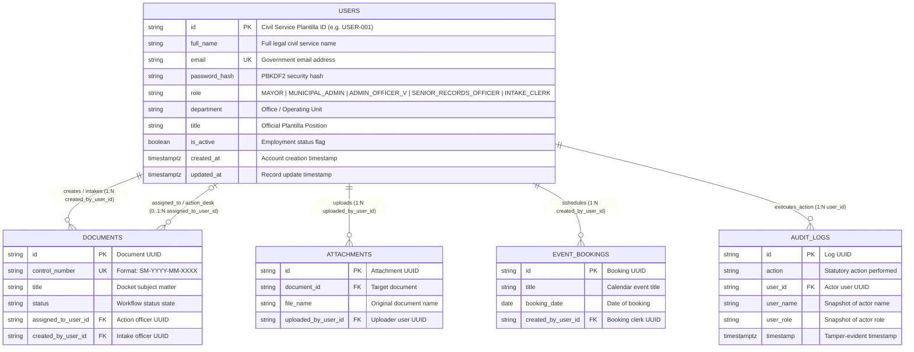
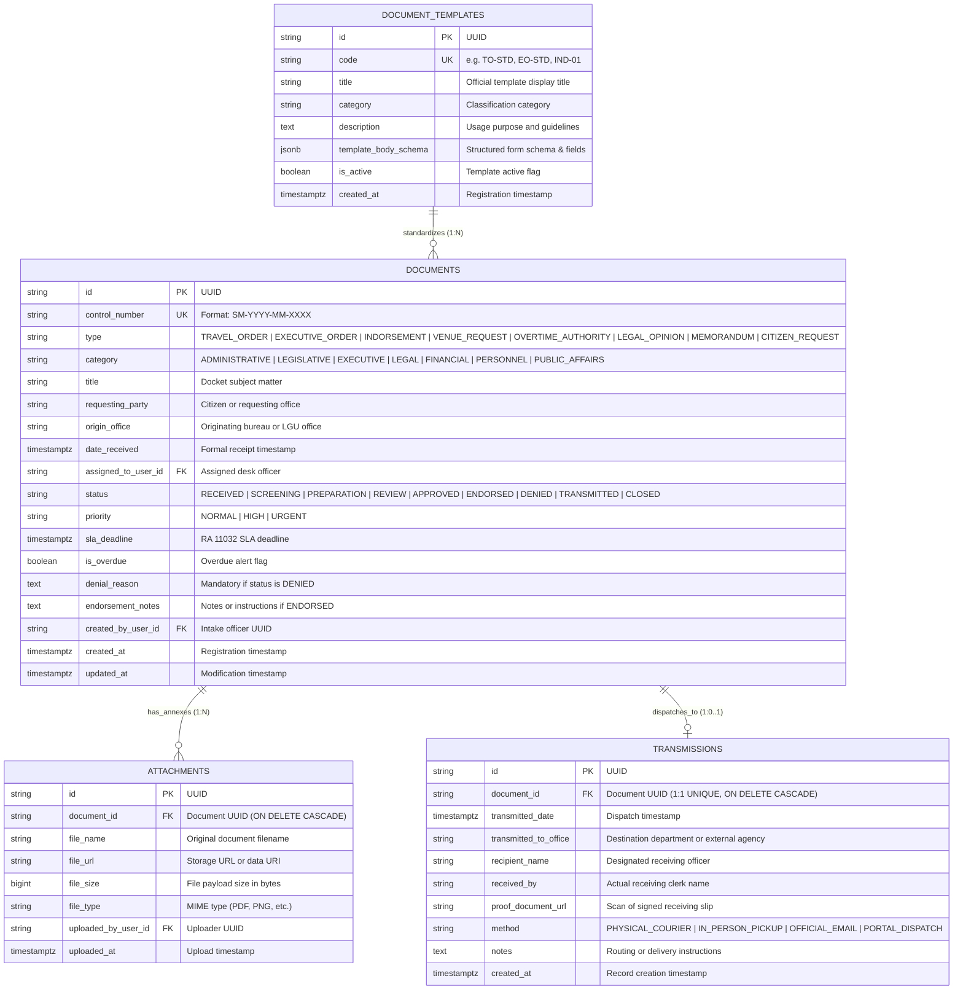
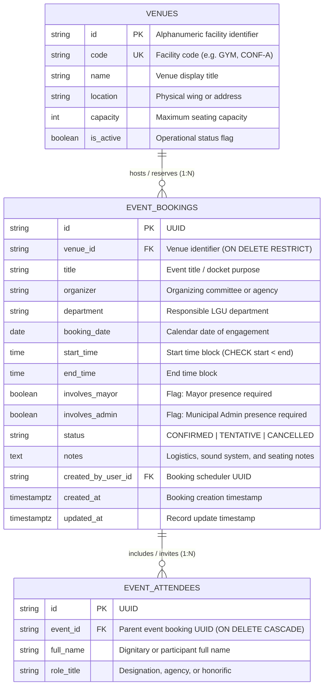
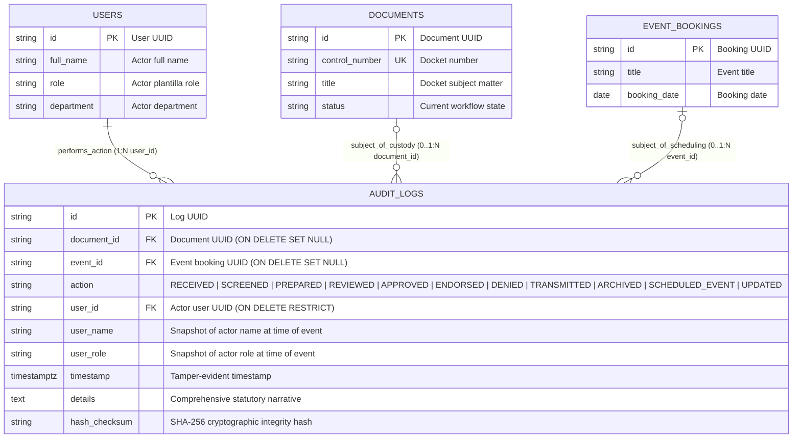

# Municipality of Santa Maria, Bulacan
## Document Management & Statutory Operations System (DocSys v2.6)
### Entity Relationship Diagrams (ERD) — Mermaid.js Specification

This directory houses the official Entity Relationship Diagrams (ERD) for the **Santa Maria DocSys** relational database architecture (PostgreSQL). The architecture is partitioned into four core statutory modules, accompanied by an all-inclusive master ERD.

---

## Architecture Breakdown

| Diagram File | Core Component | Scope & Entities |
| :--- | :--- | :--- |
| [`00-master-erd.mmd`](./00-master-erd.mmd) | **Master System ERD** | All 9 relational entities and foreign key constraints across the entire LGU ecosystem. |
| [`01-users-and-rbac.mmd`](./01-users-and-rbac.mmd) | **Civic Identity & RBAC** | Plantilla accounts, civil service roles (`MAYOR`, `MUNICIPAL_ADMIN`, etc.), desk assignments, and custody linkages. |
| [`02-document-lifecycle.mmd`](./02-document-lifecycle.mmd) | **Docket Registry & Dispatch** | Core documents, multi-file attachments/annexes, physical/electronic transmissions, and drafting templates. |
| [`03-venues-and-events.mmd`](./03-venues-and-events.mmd) | **Facilities & Gavel Scheduling** | Municipal venues, reservation scheduling, mayoral conflict prevention, and attendee registries. |
| [`04-audit-and-compliance.mmd`](./04-audit-and-compliance.mmd) | **Statutory Custody Trail** | Immutable audit ledger (RA 11032 / RA 10173), tamper-evident checksums, and cross-entity tracking. |

---

## 1. Master System ERD (`00-master-erd.mmd`)

```mermaid
erDiagram
    USERS ||--o{ DOCUMENTS : "created_by (1:N)"
    USERS |o--o{ DOCUMENTS : "assigned_to (0..1:N)"
    USERS ||--o{ ATTACHMENTS : "uploaded_by (1:N)"
    USERS ||--o{ EVENT_BOOKINGS : "booked_by (1:N)"
    USERS ||--o{ AUDIT_LOGS : "performed_by (1:N)"

    DOCUMENTS ||--o{ ATTACHMENTS : "contains (1:N)"
    DOCUMENTS ||--o| TRANSMISSIONS : "dispatches (1:0..1)"
    DOCUMENTS ||--o{ AUDIT_LOGS : "records_history (0..1:N)"

    VENUES ||--o{ EVENT_BOOKINGS : "hosts (1:N)"
    EVENT_BOOKINGS ||--o{ EVENT_ATTENDEES : "includes (1:N)"
    EVENT_BOOKINGS ||--o{ AUDIT_LOGS : "records_event (0..1:N)"

    USERS {
        string id PK "UUID / Plantilla ID"
        string full_name "Full civil service name"
        string email UK "Official LGU email"
        string password_hash "PBKDF2 security hash"
        string role "MAYOR | MUNICIPAL_ADMIN | ADMIN_OFFICER_V | SENIOR_RECORDS_OFFICER | INTAKE_CLERK"
        string department "LGU Department / Office"
        string title "Plantilla Position Title"
        boolean is_active "Active employment status"
        timestamptz created_at "Account creation timestamp"
        timestamptz updated_at "Last update timestamp"
    }

    DOCUMENTS {
        string id PK "UUID"
        string control_number UK "Docket No (SM-YYYY-MM-XXXX)"
        string type "TRAVEL_ORDER | EXECUTIVE_ORDER | INDORSEMENT | VENUE_REQUEST | etc."
        string category "ADMINISTRATIVE | LEGISLATIVE | EXECUTIVE | LEGAL | FINANCIAL | PERSONNEL | PUBLIC_AFFAIRS"
        string title "Docket subject matter"
        string requesting_party "Citizen or internal office"
        string origin_office "Originating agency / department"
        timestamptz date_received "Formal filing timestamp"
        string assigned_to_user_id FK "Assigned desk officer"
        string status "RECEIVED | SCREENING | PREPARATION | REVIEW | APPROVED | ENDORSED | DENIED | TRANSMITTED | CLOSED"
        string priority "NORMAL | HIGH | URGENT"
        timestamptz sla_deadline "RA 11032 statutory deadline"
        boolean is_overdue "True if current time > sla_deadline"
        text denial_reason "Reason if rejected"
        text endorsement_notes "Notes or instructions"
        string created_by_user_id FK "Intake officer UUID"
        timestamptz created_at "Registration timestamp"
        timestamptz updated_at "Modification timestamp"
    }

    ATTACHMENTS {
        string id PK "UUID"
        string document_id FK "Parent document UUID"
        string file_name "Original document filename"
        string file_url "Storage URL or data URI"
        bigint file_size "Payload size in bytes"
        string file_type "MIME type (PDF, PNG, etc.)"
        string uploaded_by_user_id FK "Uploader user UUID"
        timestamptz uploaded_at "Upload timestamp"
    }

    TRANSMISSIONS {
        string id PK "UUID"
        string document_id FK "Document UUID (1:1 Unique)"
        timestamptz transmitted_date "Dispatch timestamp"
        string transmitted_to_office "Target bureau / recipient office"
        string recipient_name "Designated recipient officer"
        string received_by "Actual receiving clerk name"
        string proof_document_url "Scan of signed receiving copy"
        string method "PHYSICAL_COURIER | IN_PERSON_PICKUP | OFFICIAL_EMAIL | PORTAL_DISPATCH"
        text notes "Routing or delivery instructions"
        timestamptz created_at "Record creation timestamp"
    }

    VENUES {
        string id PK "Alphanumeric ID"
        string code UK "Facility code"
        string name "Venue display title"
        string location "Physical address or wing"
        int capacity "Seating capacity"
        boolean is_active "Operational status"
    }

    EVENT_BOOKINGS {
        string id PK "UUID"
        string venue_id FK "Booked venue identifier"
        string title "Event title / purpose"
        string organizer "Organizing committee / department"
        string department "Responsible LGU department"
        date booking_date "Date of booking"
        time start_time "Start time block"
        time end_time "End time block"
        boolean involves_mayor "Mayor attendance required"
        boolean involves_admin "Admin attendance required"
        string status "CONFIRMED | TENTATIVE | CANCELLED"
        text notes "Logistics & equipment notes"
        string created_by_user_id FK "Booking clerk UUID"
        timestamptz created_at "Booking timestamp"
        timestamptz updated_at "Last update timestamp"
    }

    EVENT_ATTENDEES {
        string id PK "UUID"
        string event_id FK "Parent event booking UUID"
        string full_name "Dignitary or participant name"
        string role_title "Designation or title"
    }

    AUDIT_LOGS {
        string id PK "UUID"
        string document_id FK "Document UUID (optional)"
        string event_id FK "Event booking UUID (optional)"
        string action "RECEIVED | SCREENED | PREPARED | REVIEWED | APPROVED | ENDORSED | DENIED | TRANSMITTED | ARCHIVED | SCHEDULED_EVENT | UPDATED"
        string user_id FK "Actor user UUID"
        string user_name "Actor full name snapshot"
        string user_role "Actor role snapshot"
        timestamptz timestamp "Audit event timestamp"
        text details "Action audit narrative"
        string hash_checksum "Cryptographic checksum SHA-256"
    }

    DOCUMENT_TEMPLATES {
        string id PK "UUID"
        string code UK "Unique template code"
        string title "Official template title"
        string category "Template classification"
        text description "Usage guidelines"
        jsonb template_body_schema "Form field schema"
        boolean is_active "Template availability"
        timestamptz created_at "Registration timestamp"
    }
```

---

## 2. Component 1: Civic Identity & RBAC (`01-users-and-rbac.mmd`)

Manages authenticated government personnel, municipal plantilla designations, and role-based permissions governing docket routing and digital approvals.

---

## 3. Component 2: Document Lifecycle & Docket Registry (`02-document-lifecycle.mmd`)

Enforces the statutory document intake, preparation, legal review, executive indorsement, and dispatch pipeline according to Republic Act 11032 SLAs.

---

## 4. Component 3: Municipal Venues & Event Scheduling (`03-venues-and-events.mmd`)

Coordinates municipal facilities (gymnasiums, session halls, municipal parks) and prevents scheduling conflicts for executive appearances.

---

## 5. Component 4: Statutory Custody & Compliance Ledger (`04-audit-and-compliance.mmd`)

Provides non-repudiation and cryptographic audit trails for all actions taken on municipal dockets and public facility reservations.

---

## Relational Constraints & Cardinality Crosswalk

| Primary Table | Foreign Table | Foreign Key Column | Cardinality | Cascading Action | Business Rule |
| :--- | :--- | :--- | :---: | :--- | :--- |
| `users` | `documents` | `created_by_user_id` | `1 : N` | `ON DELETE RESTRICT` | Prevents removing personnel who officially signed for docket receipt. |
| `users` | `documents` | `assigned_to_user_id`| `0..1 : N`| `ON DELETE SET NULL` | Re-assignable to alternate action desks without orphan records. |
| `users` | `attachments`| `uploaded_by_user_id`| `1 : N` | `ON DELETE RESTRICT` | Preserves uploader accountability for uploaded scans and evidence. |
| `users` | `audit_logs` | `user_id` | `1 : N` | `ON DELETE RESTRICT` | Prevents deletion of civil servants with historical custody entries. |
| `documents` | `attachments`| `document_id` | `1 : N` | `ON DELETE CASCADE` | Purging a docket cleans its physical scanned attachments. |
| `documents` | `transmissions`| `document_id` | `1 : 0..1`| `ON DELETE CASCADE` | Each dispatched docket has at most one official transmission record. |
| `documents` | `audit_logs` | `document_id` | `0..1 : N`| `ON DELETE SET NULL` | Audit logs persist even if a draft record is archived or removed. |
| `venues` | `event_bookings`| `venue_id` | `1 : N` | `ON DELETE RESTRICT` | An active or historical municipal venue cannot be deleted if booked. |
| `event_bookings`| `event_attendees`| `event_id` | `1 : N` | `ON DELETE CASCADE` | Removing an event booking purges its attendee list. |
| `event_bookings`| `audit_logs` | `event_id` | `0..1 : N`| `ON DELETE SET NULL` | Scheduling audit logs remain permanent for accountability. |

---

## Statutory & Governance Standards
- **Republic Act 11032 (Ease of Doing Business & Efficient Government Service Delivery)**: Enforced via `sla_deadline` and `is_overdue` computations (3 days for simple, 7 days for complex, 20 days for highly technical).
- **Republic Act 10173 (Data Privacy Act of 2012)**: RBAC enforced at schema level, redacting sensitive citizen details to authorized roles (`MAYOR`, `MUNICIPAL_ADMIN`).
- **DICT Philippine Government Web Template Standard (GWTS v25.3.3)**: Standardized municipal metadata tags, timestamps with timezones (`TIMESTAMPTZ`), and ISO audit logging.
