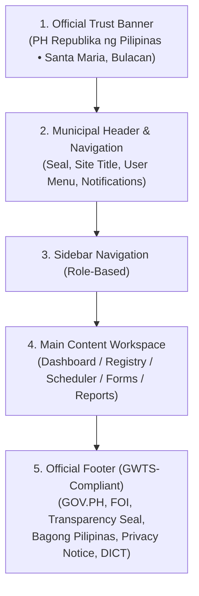
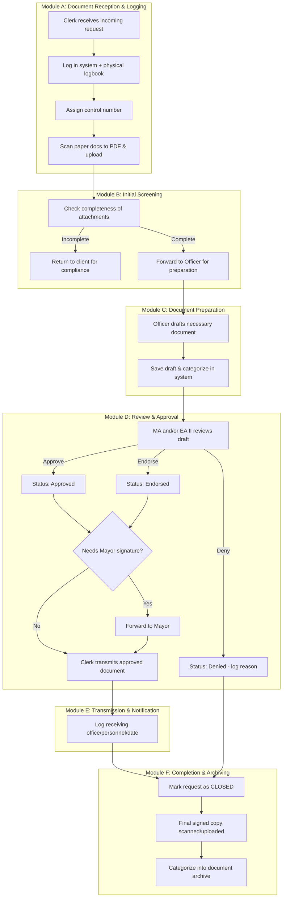
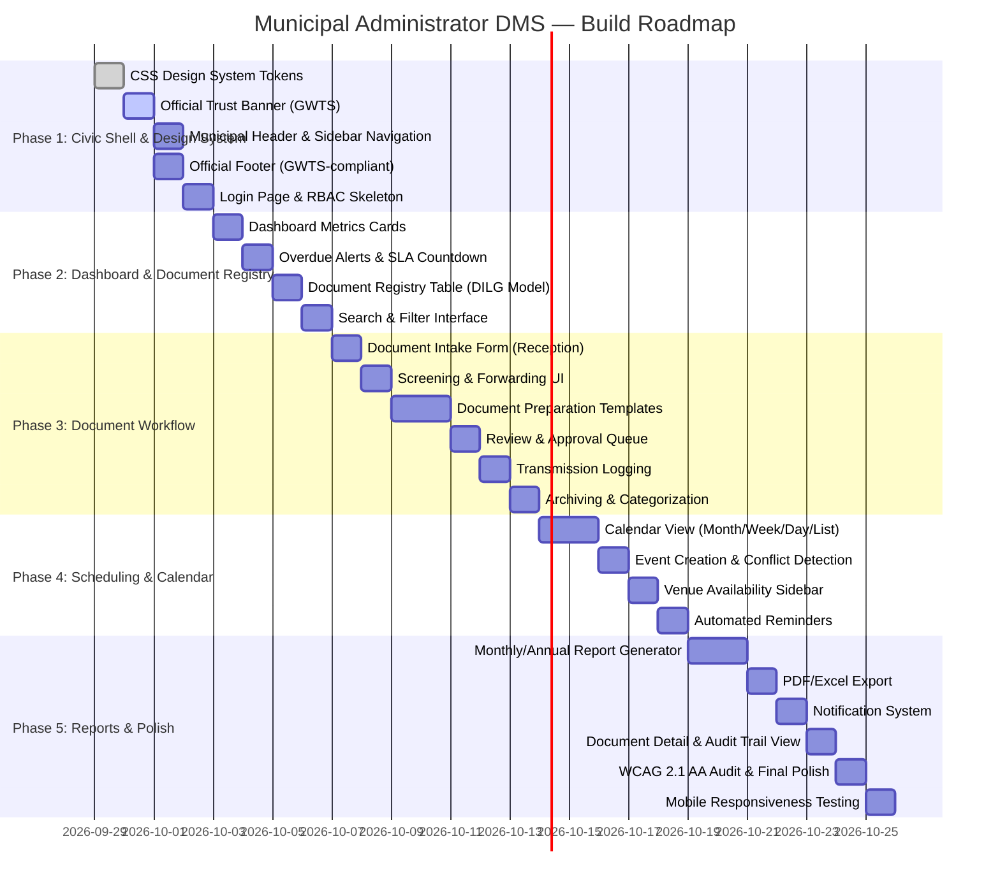

# Implementation Plan: Cloud-Based Document Management System (DMS)
**Document:** `plan.md`  
**System Name:** *Municipal Administrator's Office — Document Management System*  
**Client:** Pamahalaang Bayan ng Santa Maria, Bulacan — Office of the Municipal Administrator  
**Standards:** DICT GWTS v25.3.3 • RA 11032 (ARTA / Ease of Doing Business) • RA 10173 (Data Privacy) • RA 8491 (Heraldic Code) • RA 10535 (PST) • WCAG 2.1 AA  
**Design Reference:** See companion [`design.md`](./design.md) for full UI/UX research and pattern library.

---

## 1. Project Vision & Executive Summary

The proposed **Document Management System (DMS)** aims to digitalize, streamline, and modernize the handling of documents within the **Municipal Administrator's Office** of Santa Maria, Bulacan. It will establish a **centralized and secure platform** for managing official records, ensuring faster turnaround of requests, accurate tracking, and reliable archiving.

The system will also support compliance with the mandated **three-day processing period** for simple requests under **Republic Act No. 11032 (Ease of Doing Business and Efficient Government Service Delivery Act)** while enhancing accessibility, transparency, and accountability in municipal operations.

In addition, the system will integrate a **centralized meeting and event scheduling function** to ensure efficient use of municipal venues, prevent conflicts, and improve coordination of schedules involving the Mayor and the Administrator.

### 1.1 The Problem It Solves

| # | Problem | Impact |
| :--- | :--- | :--- |
| 1 | **Manual Paper-Based Tracking** — Incoming requests, communications, and documents are tracked in physical logbooks vulnerable to wear, loss, and delays. | Slow retrieval, risk of misplaced documents, no real-time status visibility. |
| 2 | **No Centralized Digital Archive** — Executive Orders, SB Endorsements, Contracts, Memorandum Orders, and other documents are scattered across physical folders. | Difficult to generate monthly/annual reports, hard to search historical records. |
| 3 | **RA 11032 Compliance Risk** — The 3-day processing mandate for simple requests cannot be enforced or tracked with a manual system. | Potential ARTA violations, citizen complaints via 8888 hotline, no SLA visibility. |
| 4 | **Scheduling Conflicts** — Municipal venues (Conference Room, Social Hall, Gymnasium, etc.) are booked informally, leading to double-bookings and last-minute cancellations. | Wasted time, uncoordinated meetings involving the Mayor and Administrator. |
| 5 | **Limited Accountability** — No comprehensive audit trail of who received, processed, approved, or transmitted each document. | Weak accountability, no transparency in document handling. |
| 6 | **No Remote Access** — The Administrator and staff cannot check document statuses or schedules when away from the office. | Delayed decisions, no mobile access to critical information. |

### 1.2 The Solution

A **cloud-based, role-driven operations platform** combining:

```
┌──────────────────────────────────────────────────────────────────────────┐
│          DOCUMENT MANAGEMENT SYSTEM — CORE MODULES                      │
├──────────────────────────────────┬───────────────────────────────────────┤
│  INCOMING & RECEPTION         │ [Yes] REVIEW & APPROVAL                  │
├──────────────────────────────────┼───────────────────────────────────────┤
│ • Document reception & logging   │ • MA/EA II review queue              │
│ • Control number assignment      │ • Approve, Endorse, or Deny         │
│ • Scanner/upload integration     │ • Denial reason logging             │
│ • Attachment screening           │ • Forward to Mayor if required      │
├──────────────────────────────────┼───────────────────────────────────────┤
│  DOCUMENT PREPARATION          │  TRANSMISSION & ARCHIVING          │
├──────────────────────────────────┼───────────────────────────────────────┤
│ • Draft EOs, Endorsements,       │ • Transmit to requesting party      │
│   Memos, Certifications, etc.   │ • Log receiving office/personnel    │
│ • Template-based document editor │ • Final scan/upload & categorize    │
│ • Save drafts, submit for review │ • Mark as Closed, archive           │
├──────────────────────────────────┼───────────────────────────────────────┤
│  MEETING & EVENT SCHEDULER    │  DASHBOARDS & REPORTS              │
├──────────────────────────────────┼───────────────────────────────────────┤
│ • Venue booking & conflict detect│ • Real-time operational dashboard   │
│ • 6 municipal venues             │ • Monthly/annual summary reports    │
│ • Attendee tagging (Mayor, MA)   │ • SLA compliance tracking          │
│ • Automated reminders            │ • Document category breakdown      │
└──────────────────────────────────┴───────────────────────────────────────┘
```

### 1.3 Objectives (from Project Brief)

1. Digitalize and systematically organize documents for quick retrieval and reference.
2. Establish a seamless process for receiving, logging, transmitting, and closing requests and communications.
3. Enable real-time monitoring of the status of documents (approved, endorsed, denied, pending).
4. Enforce the **three (3)-day maximum processing time** for simple requests.
5. Generate **monthly and annual summary reports** of actions taken by the Municipal Administrator's Office.
6. Strengthen accountability by recording who received, transmitted, or acted upon each document.
7. Provide **centralized scheduling of meetings and events** to avoid conflicts in venue usage and participant availability.
8. Allow the Administrator and authorized staff to check schedules remotely via phone, with **automated reminders** for meetings and events.
9. Promote transparency and efficiency in municipal administration services.

---

## 2. Visual Design System (Philippine Government Aesthetic)

### 2.1 Design Philosophy

The design bridges **official Philippine Government dignity** with **efficient internal operations UX**. It draws from three verified sources:

1. **DICT GWTS v25.3.3** — Mandatory masthead structure, text magnifier, Transparency Seal, FOI badge, Bagong Pilipinas branding, dark-themed footer.
2. **eGov Design System (`e.gov.ph`)** — CSS custom properties (`--ds-primary-base: rgb(10, 103, 210)`), standardized header/footer shells, and modern component architecture.
3. **RA 8491 Heraldic Code** — All Philippine flag-derived elements use officially specified Cable Number colors.

### 2.2 Three-Layer Color Architecture

#### Layer 1 — National Identity (RA 8491 Flag Colors)
Used for official seals, flag elements, and trust indicators only:

| Token | HEX | Cable No. | Meaning |
| :--- | :--- | :--- | :--- |
| `--ph-blue` | `#0038A8` | 80173 | Peace, truth, justice |
| `--ph-red` | `#CE1126` | 80108 | Patriotism, valor |
| `--ph-gold` | `#FCD116` | 80068 | Unity, freedom, sovereignty |
| `--ph-white` | `#FFFFFF` | 80001 | Liberty, equality, fraternity |

#### Layer 2 — Santa Maria Civic Emblem Palette (`BULACAN LOGO.png`)
Primary interactive palette for navigation, authority headers, action buttons, cards, and data visualization:

| Token | HEX | Source & Heraldic Significance | System Usage |
| :--- | :--- | :--- | :--- |
| `--civic-primary` | `#15803D` | Santa Maria Bamboo Stalk Frame | Primary action buttons, active sidebar items, links |
| `--civic-primary-dark` | `#166534` | Municipal Administrator PDF Letterhead Bar | Official letterhead bar, institutional titles, borders |
| `--civic-primary-darker` | `#081E36` | Bulacan Provincial Navy (Outer Ring & Shield) | Trust banner, sidebar background, table headers |
| `--civic-primary-light` | `#F0FDF4` | Bamboo Green 5% Tint | Active card highlights, scanner backdrop, badge bg |
| `--civic-accent` | `#D97706` | Harvest Terracotta Gold (Center Shield Field) | Pending status, SLA warning badges, certified seals |
| `--civic-accent-light` | `#FEF3C7` | Warm Gold Tint | Highlight containers, review alerts |

#### Layer 3 — Semantic Status Tokens (RA 11032 / ARTA Alignment)
Lifecycle colors for document state and 3-day turnaround compliance:

| Token | HEX | Status | Meaning |
| :--- | :--- | :--- | :--- |
| `--status-approved` | `#15803D` | Approved, Endorsed, Closed | Compliant & authorized |
| `--status-pending` | `#B45309` | Under Review, Screening | Within active processing window |
| `--status-denied` | `#DC2626` | Returned, Denied, Overdue | Flagged / exceeding 3-day mandate |
| `--status-info` | `#0B2545` | Transmitted, In Preparation | Official movement & preparation |
| `--status-new` | `#7C3AED` | Newly Received Intake | Initial logging stage |

### 2.3 Typography
| Role | Font | Size | Weight |
| :--- | :--- | :--- | :--- |
| Headings | `Inter` | H1: 32px, H2: 24px, H3: 20px | 600–700 |
| Body | `Inter` | 16px, line-height 1.65 | 400–500 |
| Data (Control #, Reference #) | `JetBrains Mono` | 15px, line-height 1.4 | 500 |
| Labels / Captions | `Inter` | 13px, line-height 1.4 | 500 |

### 2.4 Mandatory GWTS Page Elements



**Trust Banner (Topmost Element) must contain:**
- Philippine Flag SVG + *"Republika ng Pilipinas • Pamahalaang Bayan ng Santa Maria, Bulacan"*
- Live Philippine Standard Time (PST) — RA 10535
- Text Magnifier: `A-` / `A` / `A+` — GWTS standard auxiliary menu
- High Contrast toggle — WCAG compliance

**Footer (Bottommost Element) must contain:**
- Municipal Seal + full address (Poblacion, Santa Maria, Bulacan 3022)
- Email: smb.maoffice@gmail.com
- Links: GOV.PH, Official Gazette, FOI, Transparency Seal, Privacy Notice, Citizen's Charter, Accessibility, Sitemap
- Compliance Seals: Transparency Seal, FOI Badge, Bagong Pilipinas Logo, DICT Logo
- Copyright with year

---

## 3. Core Functional Modules & Architecture



---

### 3.1 Module A: Document Reception & Logging (Step 1)

The Clerk/Encoder's primary intake interface for incoming requests.

#### Document Types Covered (from Project Brief):

| # | Document Type | Description | Control # Format |
| :--- | :--- | :--- | :--- |
| 1 | **Incoming Requests** | Client requests, proposals, official letters | Incoming No. |
| 2 | **Travel Orders** | Requests for official travel with supporting approvals | Travel Order No. |
| 3 | **Venue Requests** | Use of municipal facilities/venues | Incoming No. |
| 4 | **Vehicle Requests** | Use of municipal service vehicles | Incoming No. |
| 5 | **Food Requests** | Catering/food support for official functions | Incoming No. |
| 6 | **Overtime Requests** | Work beyond regular office hours | Overtime No. |
| 7 | **Endorsements** | Endorsements prepared for Sanggunian Bayan | Incoming No. |
| 8 | **Permits** | Certifications, clearances, permits | Incoming No. |
| 9 | **Legal Opinions** | Opinions/reviews from the Legal Consultant | Incoming No. |
| 10 | **Other Communications** | All other incoming communications and requests | Incoming No. |

#### Reception Process:
1. Clerk/Encoder receives incoming request (letters, proposals, permits, travel orders, venue/vehicle requests, food/overtime requests, endorsements, legal opinions, etc.)
2. Control number is assigned (e.g., Incoming No., Travel Order No., Overtime No.)
3. Clerk logs request in **both the system and physical logbook**
4. Paper-based documents are **scanned to PDF** and uploaded to the system

#### Intake Form Fields:
| Field | Type | Required | Notes |
| :--- | :--- | :---: | :--- |
| Document Type | Select dropdown | [Yes] | See list above |
| Control Number | Auto-generated + editable | [Yes] | Format varies by type |
| Subject / Title | Text input | [Yes] | Descriptive title |
| Requesting Party | Text input | [Yes] | Person or office making request |
| Office / Department | Text input | [Yes] | Origin department |
| Date Received | Date picker | [Yes] | Defaults to today |
| Scanned Document | File upload (PDF, JPG, PNG) | [Yes] | Supports scanner input |
| Attachments | Multi-file upload | [No] | Supporting documents |
| Notes | Text area | [No] | Clerk's notes |

---

### 3.2 Module B: Initial Screening (Step 2)

The Clerk/Encoder checks completeness of attachments:

- **Incomplete** → Returned to client for compliance (status logged with reason)
- **Complete** → Forwarded to Officer for preparation

#### Screening Checklist:
- Are all required attachments present?
- Is the request properly addressed to the Municipal Administrator's Office?
- Is the control number correctly assigned?
- Are all required signatures on the source document present?

---

### 3.3 Module C: Document Preparation (Step 3)

The Officer/Clerk drafts the necessary response document based on the incoming request.

#### Documents Prepared:

| # | Document Type | Typical Content |
| :--- | :--- | :--- |
| 1 | **Executive Orders** | Official orders issued by the Mayor |
| 2 | **SB Endorsements** | Endorsements prepared for Sanggunian Bayan |
| 3 | **Memorandum Orders** | Notice of Meeting, Personnel Memo, Office Memo |
| 4 | **Certifications & Permits** | Certifications, clearances, permits |
| 5 | **Endorsement Letters & Recommendations** | For work, medical, hospital, or financial assistance |
| 6 | **Legal Opinions** | Endorsed to Legal Consultant |
| 7 | **Response Letters** | Official responses to incoming communications |
| 8 | **Letter Requests for National Agencies** | Requests for project fundings and other concerns |

#### Preparation Features:
- Template-based document editor with pre-filled headers (Republic of the Philippines, Province of Bulacan, Municipality of Santa Maria, Office of the Municipal Administrator)
- Auto-populated fields from the source incoming request
- Save as Draft capability
- Submit for Review to MA/EA II
- Attach supplementary files

---

### 3.4 Module D: Review & Approval (Step 4)

The Municipal Administrator and/or Executive Assistant II reviews drafts.

#### Approval Actions:
| Action | Description | Next Step |
| :--- | :--- | :--- |
| **Approve** | Document is accepted as-is | Proceeds to Mayor (if required) or transmission |
| **Endorse** | Document is endorsed with MA recommendation | Proceeds to Mayor (if required) or transmission |
| **Deny** | Document is rejected | Reason logged, status updated, request closed |

#### Review Queue Features:
- Sorted by priority (overdue items first)
- SLA countdown timer on each pending item (3-day limit)
- Red highlight for overdue requests
- One-click approve/endorse with optional comments
- Denial requires mandatory reason field
- View original scanned document alongside draft

---

### 3.5 Module E: Transmission & Notification (Step 5)

Clerk/Encoder transmits the approved/signed document to the requesting party or endorses it to the concerned office.

#### Transmission Logging:
| Field | Description |
| :--- | :--- |
| Receiving Office/Person | Who received the transmitted document |
| Date Transmitted | When the document was handed over |
| Received By (Name) | Name of person who physically received |
| Method | In-person, through messenger, via email |
| Status | Updated to "Transmitted" |

---

### 3.6 Module F: Completion & Archiving (Step 6)

Once fulfilled (approved/endorsed/denied), the request is marked as **Closed**.

#### Archiving Process:
1. Final signed copy is **scanned/uploaded** into its document category
2. Clerk logs the release of the document, including the recipient
3. Document remains **accessible for reporting and future reference**
4. Categorized into the **Digital Archive** by document type

#### Archive Categories (for Reports):
- Executive Orders
- SB Endorsements
- Contracts/Agreements
- Certifications
- Permits
- Memorandum Orders
- Legal Advice
- Work Endorsements
- Communication Letter for National Agencies
- Other communications and requests

---

### 3.7 Module G: Centralized Meeting & Event Scheduling

A unified calendar system for meetings and official functions to **avoid conflicts in schedule and venue use**.

#### Municipal Venues Covered:
| # | Venue | Notes |
| :--- | :--- | :--- |
| 1 | **Municipal Conference Room** | General meetings |
| 2 | **Command Center Room** | Operations/emergency meetings |
| 3 | **Social Hall** | Large events, summits, assemblies |
| 4 | **Gymnasium** | Large gatherings, DILG events |
| 5 | **Mayor's Conference Room** | Special meetings involving the Mayor |
| 6 | **Administrator's Office** | Special meetings with the MA |

#### Scheduling Features:
- **Schedule creation, editing, and cancellation** with role-based access
- **Venue booking and conflict detection** — system prevents double-booking
- **Tagging of required attendees** (Mayor, Administrator, other personnel)
- **Mobile access** for quick schedule checking via phone
- **Automated reminders/notifications** to attendees via the system (1 day before, 1 hour before)
- **Calendar views:** Month, Week, Day, and List view
- **Venue availability sidebar** showing real-time availability of all 6 venues

---

### 3.8 Module H: Dashboards & Reports

#### Dashboard Metrics:
- Total documents received (today, this week, this month)
- Incoming requests count with trend comparison
- Pending actions count with SLA warnings
- Closed/completed transactions count
- Today's scheduled meetings with next event preview
- Overdue requests alert list

#### Monthly & Annual Summary Reports:
Reports covering document counts broken down by:
- Executive Orders
- SB Endorsements
- Contracts/Agreements
- Certifications
- Permits
- Memorandum Orders
- Legal Advice
- Work Endorsements
- Communication Letter for National Agencies
- Other communications and requests

#### Report Data Points:
| Metric | Monthly | Annual |
| :--- | :---: | :---: |
| Documents received by category | [Yes] | [Yes] |
| Documents closed/completed | [Yes] | [Yes] |
| Documents pending/in-progress | [Yes] | [Yes] |
| Average processing time | [Yes] | [Yes] |
| SLA compliance rate (within 3 days) | [Yes] | [Yes] |
| Overdue requests count | [Yes] | [Yes] |
| Meetings held by venue | [Yes] | [Yes] |
| Export to PDF/Excel | [Yes] | [Yes] |

---

### 3.9 Module I: Search & Retrieval (DILG Model)

Per the project brief, search follows the **DILG Issuances Archive** pattern:

#### Search Features:
- **Keyword search** across title, subject, and control number
- **Category filter** dropdown (Title/Subject)
- **Control number search** — exact match for quick lookup
- **Inline PDF previews** of scanned documents
- **Offline downloads** enabled for authorized users
- **Date range filter** for narrowing results

#### Searchable Attributes:
| Field | Example | Matching |
| :--- | :--- | :--- |
| Control Number | `IN-2026-0912`, `TO-2026-0045` | Exact + prefix |
| Title / Subject | "Travel Order Request" | Keyword/fuzzy |
| Document Category | Executive Order, SB Endorsement, etc. | Dropdown filter |
| Requesting Party | "PESO Office", "Engr. Santos" | Keyword |
| Status | Received, Pending, Approved, Denied, Closed | Checkbox filter |
| Date Received | Sep 28, 2026 | Date range |
| Assigned Officer | Officer J. Garcia | Dropdown filter |

---

## 4. Technical Architecture & Stack

### 4.1 Technology Selection

The project brief specifies a **cloud-based** system with **desktop (Windows) as primary** and **web and mobile browser** accessibility.

```
Application Architecture (Next.js)
├── app/
│   ├── layout.tsx              — Root layout with GWTS trust banner, header, footer
│   ├── page.tsx                — Login page (default landing)
│   ├── dashboard/
│   │   └── page.tsx            — Operational dashboard with metrics
│   ├── incoming/
│   │   ├── page.tsx            — Incoming documents list
│   │   └── new/page.tsx        — New document intake form
│   ├── registry/
│   │   ├── page.tsx            — Full document registry with search
│   │   └── [id]/page.tsx       — Document detail view
│   ├── prepare/
│   │   └── [id]/page.tsx       — Document preparation/drafting
│   ├── review/
│   │   └── page.tsx            — Review & approval queue
│   ├── transmit/
│   │   └── page.tsx            — Transmission logging
│   ├── archive/
│   │   └── page.tsx            — Archived documents browser
│   ├── schedule/
│   │   └── page.tsx            — Meeting & event calendar
│   ├── reports/
│   │   └── page.tsx            — Report generator
│   └── settings/
│       └── page.tsx            — User management (admin only)
├── components/
│   ├── TrustBanner.tsx         — GWTS official trust banner
│   ├── GovHeader.tsx           — Municipal header with seal
│   ├── GovFooter.tsx           — GWTS-compliant footer
│   ├── Sidebar.tsx             — Role-based sidebar navigation
│   ├── StatusBadge.tsx         — Document status indicators
│   ├── MetricCard.tsx          — Dashboard metric cards
│   ├── TimelineStep.tsx        — Workflow timeline component
│   ├── DocumentTable.tsx       — Sortable/filterable data table
│   ├── CalendarView.tsx        — Monthly/weekly/daily calendar
│   ├── EventModal.tsx          — Event creation/edit modal
│   ├── NotificationBell.tsx    — Notification dropdown
│   ├── SearchBar.tsx           — DILG-style search interface
│   └── DocumentTemplate.tsx    — Template-based document editor
├── lib/
│   ├── data.ts                 — Seed data and mock data
│   ├── types.ts                — TypeScript interfaces
│   ├── auth.ts                 — Authentication utilities
│   └── utils.ts                — Helper functions
└── public/
    ├── ph-flag.svg             — Official PH flag (RA 8491 colors)
    ├── sta-maria-seal.svg      — Municipal seal
    ├── transparency-seal.svg   — Transparency Seal badge
    ├── foi-badge.svg           — FOI badge
    ├── bagong-pilipinas.svg    — Bagong Pilipinas logo
    └── dict-logo.svg           — DICT logo
```

### 4.2 Why This Stack

| Decision | Rationale |
| :--- | :--- |
| **Next.js (React)** | Full-stack framework with server-side rendering, API routes, and excellent TypeScript support. Aligns with the BIR's eGov Design System approach. Cloud-deployable to Vercel/GCP. |
| **TypeScript** | Type safety for complex document workflow states, RBAC permissions, and data models. Reduces bugs in a government compliance system. |
| **CSS Custom Properties** | Mirrors the eGov Design System approach (`--ds-primary-base`). Enables theme switching (light/dark/high-contrast) without class swapping. |
| **Cloud-Based Deployment** | Per project brief requirement. Enables remote access via web/mobile browsers for authorized staff. |
| **Responsive Design** | Desktop-first (Windows workstation) with mobile accessibility for schedule checking and status monitoring. |

### 4.3 Data Models

```typescript
// Core document record
interface Document {
  id: string;                    // "IN-2026-0912"
  controlNumber: string;         // "IN-2026-0912" or "TO-2026-0045"
  type: DocumentType;            // INCOMING | TRAVEL_ORDER | VENUE_REQ | VEHICLE_REQ | FOOD_REQ | OVERTIME_REQ | ENDORSEMENT | PERMIT | LEGAL_OPINION | OTHER
  category: DocumentCategory;    // EXEC_ORDER | SB_ENDORSEMENT | CONTRACT | CERTIFICATION | PERMIT | MEMO_ORDER | LEGAL_ADVICE | WORK_ENDORSEMENT | COMM_LETTER | OTHER
  title: string;                 // Subject/title of the document
  requestingParty: string;       // Person or office making the request
  originOffice: string;          // Source department
  dateReceived: string;          // ISO 8601 datetime
  assignedTo: string | null;     // Officer assigned for preparation
  status: DocumentStatus;        // RECEIVED | SCREENING | PREPARATION | REVIEW | APPROVED | ENDORSED | DENIED | TRANSMITTED | CLOSED
  scannedFileUrl: string | null; // URL to scanned PDF
  attachments: Attachment[];     // Supporting documents
  draftDocumentUrl: string | null; // URL to prepared draft
  denialReason: string | null;   // If denied, the reason
  transmissionDetails: TransmissionDetails | null;
  slaDeadline: string;           // ISO 8601 — 3 working days from dateReceived
  isOverdue: boolean;            // Computed: current time > slaDeadline && status not CLOSED
  createdBy: string;             // Clerk who logged it
  createdAt: string;             // ISO 8601
  updatedAt: string;             // ISO 8601
}

// Transmission details
interface TransmissionDetails {
  receivingOffice: string;       // Who received the transmitted document
  receivedByName: string;        // Name of person who received
  dateTransmitted: string;       // ISO 8601
  method: "in-person" | "messenger" | "email";
}

// Attachment
interface Attachment {
  id: string;
  fileName: string;
  fileUrl: string;
  fileType: string;              // "application/pdf" | "image/jpeg" | etc.
  uploadedBy: string;
  uploadedAt: string;
}

// Audit log entry
interface AuditEntry {
  id: string;
  documentId: string;
  timestamp: string;             // ISO 8601 with PH timezone
  userId: string;
  userName: string;
  userRole: UserRole;
  action: AuditAction;          // RECEIVED | SCREENED | RETURNED | PREPARED | SUBMITTED_FOR_REVIEW | APPROVED | ENDORSED | DENIED | TRANSMITTED | ARCHIVED | CLOSED | VIEWED | EDITED
  details: string;               // Additional context
}

// Meeting/Event
interface MeetingEvent {
  id: string;
  title: string;
  venue: Venue;                  // CONFERENCE_ROOM | COMMAND_CENTER | SOCIAL_HALL | GYMNASIUM | MAYOR_OFFICE | ADMIN_OFFICE
  date: string;                  // ISO 8601 date
  startTime: string;             // "14:00"
  endTime: string;               // "16:00"
  requiredAttendees: string[];   // ["Mayor", "Municipal Administrator", ...]
  description: string;
  reminders: ReminderConfig;     // { oneDayBefore: boolean, oneHourBefore: boolean }
  createdBy: string;
  status: "scheduled" | "cancelled" | "completed";
}

// User
interface User {
  id: string;
  username: string;
  fullName: string;
  role: UserRole;                // ADMINISTRATOR | EXECUTIVE_ASSISTANT | OFFICER | CLERK_ENCODER
  isActive: boolean;
}

// Enums
type DocumentType = "INCOMING" | "TRAVEL_ORDER" | "VENUE_REQ" | "VEHICLE_REQ" | "FOOD_REQ" | "OVERTIME_REQ" | "ENDORSEMENT" | "PERMIT" | "LEGAL_OPINION" | "OTHER";

type DocumentCategory = "EXEC_ORDER" | "SB_ENDORSEMENT" | "CONTRACT" | "CERTIFICATION" | "PERMIT" | "MEMO_ORDER" | "LEGAL_ADVICE" | "WORK_ENDORSEMENT" | "COMM_LETTER" | "OTHER";

type DocumentStatus = "RECEIVED" | "SCREENING" | "PREPARATION" | "REVIEW" | "APPROVED" | "ENDORSED" | "DENIED" | "TRANSMITTED" | "CLOSED";

type UserRole = "ADMINISTRATOR" | "EXECUTIVE_ASSISTANT" | "OFFICER" | "CLERK_ENCODER";

type Venue = "CONFERENCE_ROOM" | "COMMAND_CENTER" | "SOCIAL_HALL" | "GYMNASIUM" | "MAYOR_OFFICE" | "ADMIN_OFFICE";

type AuditAction = "RECEIVED" | "SCREENED" | "RETURNED" | "PREPARED" | "SUBMITTED_FOR_REVIEW" | "APPROVED" | "ENDORSED" | "DENIED" | "TRANSMITTED" | "ARCHIVED" | "CLOSED" | "VIEWED" | "EDITED";
```

---

## 5. Role-Based Access Control (RBAC)

Per the project brief, the system has four defined roles:

### 5.1 Municipal Administrator (Approver)
**Typical User:** Engr. Elmer B. Clemente
- **Full access** to all system functions
- Reviews/approves/denies requests
- Manages users, reports, and settings
- Views comprehensive dashboards and audit logs

### 5.2 Executive Assistant II (Approver)
**Typical User:** Benito C. Fabian
- Reviews, endorses, approves/denies requests
- Accesses dashboards and reports
- Cannot manage users or system settings

### 5.3 Officer
**Typical Users:** Administrative staff
- Prepares documents (Executive Orders, endorsements, certifications, permits)
- Contributes to reports
- Views assigned documents only
- Cannot approve/deny or manage users

### 5.4 Clerk/Encoder
**Typical User:** Sherelyn O. Libao
- Receives, logs, scans/uploads documents
- Assigns control numbers
- Handles tagging, transmission, archiving
- Prepares simple response letters, permits, certifications, and endorsements
- Handles venue scheduling

---

## 6. Seed Data: Realistic MA Office Records

To make the system immediately testable and true-to-life, the prototype will include realistic records:

### Record 1 — Incoming Travel Order Request
| Field | Value |
| :--- | :--- |
| **Control No.** | `TO-2026-0045` |
| **Type** | Travel Order |
| **Subject** | Travel Order Request — Engr. Santos for DILG Regional Meeting |
| **Requesting Party** | Engr. Roberto Santos, Municipal Engineer |
| **Date Received** | Sep 30, 2026 |
| **Status** | [Pending] Pending Review |
| **SLA Deadline** | Oct 3, 2026 (⏰ 1 day left) |

### Record 2 — SB Endorsement (Completed)
| Field | Value |
| :--- | :--- |
| **Control No.** | `IN-2026-0911` |
| **Type** | Endorsement |
| **Category** | SB Endorsement |
| **Subject** | SB Endorsement — Resolution No. 2026-089, Re: Appropriation of Funds for Senior Citizens Program |
| **Requesting Party** | SB Secretary Office |
| **Date Received** | Sep 28, 2026 |
| **Status** | [Yes] Closed / Archived |
| **Approved By** | Engr. Elmer B. Clemente, MA |

### Record 3 — Venue Request (Overdue)
| Field | Value |
| :--- | :--- |
| **Control No.** | `IN-2026-0908` |
| **Type** | Venue Request |
| **Subject** | Venue Request — PESO Office for Municipal Job Fair |
| **Requesting Party** | PESO Office — Maria Clara Reyes |
| **Venue Requested** | Social Hall |
| **Date Received** | Sep 26, 2026 |
| **Status** | [Urgent] Overdue (5 days past SLA) |

### Record 4 — Executive Order Draft
| Field | Value |
| :--- | :--- |
| **Control No.** | `IN-2026-0905` |
| **Type** | Incoming Request |
| **Category** | Executive Order |
| **Subject** | Request for Executive Order — Creation of Municipal Anti-Drug Abuse Council |
| **Requesting Party** | DILG Provincial Office |
| **Date Received** | Sep 25, 2026 |
| **Status** |  In Preparation |
| **Assigned To** | Officer J. Garcia |

### Record 5 — Legal Opinion Request
| Field | Value |
| :--- | :--- |
| **Control No.** | `IN-2026-0910` |
| **Type** | Legal Opinion |
| **Subject** | Request for Legal Opinion — Validity of Contract with ABC Construction Corp. |
| **Requesting Party** | Municipal Engineering Office |
| **Date Received** | Sep 29, 2026 |
| **Status** | [Pending] Under Review |
| **Endorsed To** | Municipal Legal Consultant |

### Record 6 — Memorandum Order (Notice of Meeting)
| Field | Value |
| :--- | :--- |
| **Control No.** | `MO-2026-0112` |
| **Type** | Memorandum Order |
| **Subject** | Notice of Meeting — ADAC Performance Audit and Awards Committee |
| **Recipients** | All ADAC Committee Members |
| **Date** | Oct 1, 2026, 2:00 PM |
| **Venue** | Municipal Conference Room |
| **Status** | [Yes] Approved & Transmitted |

### Sample Meeting/Event Records

| # | Title | Date | Time | Venue | Attendees |
| :--- | :--- | :--- | :--- | :--- | :--- |
| 1 | ADAC Performance Audit Meeting | Oct 1, 2026 | 2:00–4:00 PM | Municipal Conference Room | Mayor, MA, ADAC Members |
| 2 | Barangay Captains Summit | Oct 1, 2026 | 4:00–6:00 PM | Social Hall | Mayor, MA, All Barangay Captains |
| 3 | FY 2027 Budget Review | Oct 2, 2026 | 9:00–11:00 AM | Mayor's Conference Room | Mayor, MA, Budget Officer, Treasurer |
| 4 | DILG Field Visit Coordination | Oct 8, 2026 | 9:00–12:00 PM | Gymnasium | MA, DILG Representatives |
| 5 | Staff Meeting — MA Office | Oct 10, 2026 | 1:00–2:00 PM | Municipal Conference Room | MA, EA II, Officers, Clerks |

---

## 7. Compatibility & Integration Requirements

Per the project brief:

### 7.1 Platform Compatibility
| Platform | Requirement |
| :--- | :--- |
| **Desktop (Windows)** | Primary environment — all features fully functional |
| **Web Browsers** | Chrome, Edge, Firefox — accessible for authorized users |
| **Mobile Browsers** | Responsive design for schedule checking and status monitoring |

### 7.2 File Format Support
| Format | Usage |
| :--- | :--- |
| **MS Word (.docx)** | Document templates, draft exports |
| **MS Excel (.xlsx)** | Report exports, data tables |
| **Adobe PDF (.pdf)** | Scanned documents, final signed copies, report generation |
| **Images (JPG, PNG)** | Scanned documents from scanner hardware |

### 7.3 Hardware Integration
| Device | Usage |
| :--- | :--- |
| **Document Scanner** | Scanner-friendly interface for converting paper to digital files |
| **Printer** | Printer-friendly views for all document types and reports |

---

## 8. Phased Implementation Roadmap



### Phase-by-Phase Detailed Tasks

#### Phase 1: The Civic Foundation Shell (Days 1–5)
- [ ] Create CSS design system with complete custom property architecture (three-layer palette, typography scale, spacing, breakpoints, focus states).
- [ ] Build root layout with semantic structure: trust banner → header → sidebar + main → footer.
- [ ] **Trust Banner:** PH Flag SVG, official text, live PST clock (JavaScript `Date` with timezone), text magnifier A-/A/A+, high contrast toggle.
- [ ] **Municipal Header:** Santa Maria seal, "Document Management System" title, "Office of the Municipal Administrator" subtitle, notification bell, user menu.
- [ ] **Sidebar Navigation:** Role-based menu items (Dashboard, Incoming, Registry, Prepare, Review, Transmit, Archive, Scheduling, Reports, Settings).
- [ ] **Civic Footer:** GWTS-compliant dark footer with all mandatory links (GOV.PH, FOI, Transparency Seal, Privacy Notice, Citizen's Charter, Accessibility, Sitemap), compliance seal images, contact info (smb.maoffice@gmail.com), copyright.
- [ ] **Login Page:** Municipal seal, system name, username/password form, RA 10173 acknowledgement.
- [ ] **RBAC Skeleton:** Route protection, role-based sidebar rendering, permission checks.
- [ ] **Responsive Breakpoints:** Test at 360px (mobile), 768px (tablet), 1024px (desktop), 1440px (wide).

#### Phase 2: Dashboard & Document Registry (Days 6–9)
- [ ] **Dashboard:** 4 metric cards (Incoming Today, Pending Action, Closed This Month, Today's Meetings) with trend arrows and SLA warnings.
- [ ] **Overdue Alerts Section:** Red-highlighted list of requests exceeding 3-day SLA.
- [ ] **Documents by Category Chart:** Horizontal bar chart of document types processed this month.
- [ ] **Upcoming Schedule Preview:** Compact list of today's and tomorrow's events.
- [ ] **Document Registry Table:** Sortable columns (Control No., Title, Category, Status, Date), pagination, row click for detail.
- [ ] **DILG-Model Search:** Keyword search input + category dropdown filter + date range filter.
- [ ] **Status Filters:** Checkbox filters for All, Received, Pending, Approved, Denied, Closed, Overdue.

#### Phase 3: The Full Document Workflow (Days 10–16)
- [ ] **Document Intake Form (3-Step Wizard):**
  - Step 1: Document type selection + control number + core fields.
  - Step 2: File upload (scan/PDF) + attachments.
  - Step 3: Review summary + submit.
- [ ] **Screening Interface:** Clerk marks attachments complete/incomplete, forward to Officer or return to client.
- [ ] **Document Preparation Templates:**
  - Executive Order template
  - SB Endorsement template
  - Memorandum Order template (Notice of Meeting, Personnel Memo, Office Memo)
  - Certification & Permit template
  - Endorsement Letter template
  - Legal Opinion template
  - Response Letter template
  - Letter Request for National Agencies template
- [ ] **Review & Approval Queue:** Cards with SLA countdown, approve/endorse/deny buttons, denial reason field.
- [ ] **Transmission Logging:** Form capturing receiving office, person, date, method, and status update.
- [ ] **Archiving:** Mark as Closed, final scan upload, categorize into archive.

#### Phase 4: Meeting & Event Scheduling (Days 17–21)
- [ ] **Calendar Component:** Month/Week/Day/List views with color-coded events by venue.
- [ ] **Event Creation Modal:** Title, venue dropdown, date, start/end time, required attendees (Mayor, MA, EA II, Other), description, reminders.
- [ ] **Venue Conflict Detection:** Real-time check when booking — alert if venue is already reserved.
- [ ] **Venue Availability Sidebar:** Real-time status of all 6 municipal venues.
- [ ] **Automated Reminders:** Notification triggers for 1 day before and 1 hour before events.

#### Phase 5: Reports, Notifications & Polish (Days 22–28)
- [ ] **Monthly/Annual Report Generator:** Summary tables by document category (received, closed, pending).
- [ ] **Compliance Metrics:** Average processing time, SLA compliance rate, overdue count.
- [ ] **PDF/Excel Export:** Generate downloadable reports in PDF and Excel formats.
- [ ] **Print-Friendly Views:** CSS print styles for reports, document details, and schedules.
- [ ] **Notification System:** Bell icon with dropdown, notification types (overdue, approval needed, meeting reminder, status update).
- [ ] **Document Detail View:** Side-by-side layout (document info + workflow timeline), scanned PDF viewer, audit trail log.
- [ ] **Full WCAG 2.1 AA Audit:** Keyboard navigation, screen reader support, color contrast verification, 200% zoom test.
- [ ] **Mobile Responsiveness:** Test schedule checking, status viewing, and notification reading on mobile browsers.

---

## 9. Expected Benefits (from Project Brief)

1. [Yes] Faster turnaround of requests within the mandated **3-day period**.
2. [Yes] Centralized and organized **digital archive** of municipal documents.
3. [Yes] Stronger accountability and transparency through detailed logs.
4. [Yes] Improved inter-office communication and coordination.
5. [Yes] Reduced risk of lost or misplaced documents.
6. [Yes] Greater efficiency in preparing executive orders, endorsements, and certifications.
7. [Yes] **Optimized scheduling of meetings and events**, avoiding conflicts in venue and participant availability.
8. [Yes] Convenient **mobile access** to daily schedules and automatic **reminder notifications** for meetings and events.

---

## 10. Legal & Compliance Requirements Summary

| Requirement | Law | Implementation |
| :--- | :--- | :--- |
| 3-day processing for simple requests | RA 11032 (ARTA / Ease of Doing Business) | Countdown timer, SLA tracking, overdue alerts, escalation |
| Comprehensive audit logs | RA 11032 | Full action logging with who/when/what/why |
| Transparency Seal | NBC 542, GAA | Homepage badge → dedicated page |
| Freedom of Information | EO 02 s.2016 | FOI badge → `foi.gov.ph` |
| Data Privacy | RA 10173 | RBAC, login acknowledgement, audit logs |
| Philippine Standard Time | RA 10535 | Live PST clock in masthead |
| Flag Colors | RA 8491 | Cable Number hex codes for all flag elements |
| Website Template | DICT GWTS v25.3.3 | Header/footer structure, text magnifier |
| Administration Branding | OP Directive | Bagong Pilipinas logo in footer |
| Recordkeeping | Various regulations | Categorized digital archive, searchable records |

---

## 11. Success Criteria & Verification Checklist

When completed, the system must satisfy:

- [ ] **Project Brief Alignment:** All features specified in the Municipal Administrator's Office project brief are implemented.
- [ ] **6-Step Workflow:** Complete document lifecycle (Reception → Screening → Preparation → Review/Approval → Transmission → Archiving) works end-to-end.
- [ ] **GWTS Compliance:** All mandatory elements present (trust banner, PST clock, text magnifier, Transparency Seal, FOI badge, Bagong Pilipinas, dark footer with GOV.PH links).
- [ ] **3-Day SLA Enforcement:** Every pending request shows a countdown timer, overdue items are flagged and escalated.
- [ ] **RBAC Working:** Four roles (Administrator, Executive Assistant II, Officer, Clerk/Encoder) with correct permission boundaries.
- [ ] **Document Registry:** All 10+ document types can be received, searched, filtered, and viewed with the DILG-model search pattern.
- [ ] **Meeting Scheduler:** Calendar with 6 venues, conflict detection, attendee tagging, and automated reminders.
- [ ] **Reports:** Monthly and annual summary reports with document category breakdown, SLA compliance metrics, exportable to PDF/Excel.
- [ ] **Audit Trail:** Every action (receive, screen, prepare, approve, deny, transmit, archive) logged with user, timestamp, and details.
- [ ] **Mobile Accessible:** Schedule checking, status viewing, and notifications work on mobile browsers.
- [ ] **Scanner/Printer Friendly:** Documents can be scanned to PDF and uploaded; all views have print-friendly CSS.
- [ ] **File Format Support:** System handles PDF, Word, Excel, and image files for upload/download/export.
- [ ] **WCAG 2.1 AA:** Full keyboard navigation, visible focus rings, screen reader support, 4.5:1 contrast, 200% zoom without horizontal scroll.
- [ ] **Performance:** Pages load in under 2 seconds, responsive interactions, smooth animations.

---

## 12. Stakeholders & Signatories

| Role | Name | Title |
| :--- | :--- | :--- |
| **Prepared By** | Sherelyn O. Libao | Administrative Officer IV |
| **Noted By** | Benito C. Fabian | Executive Assistant II |
| **Approved By** | Engr. Elmer B. Clemente | Municipal Administrator |

**Office Contact:**  
Poblacion, Santa Maria, Bulacan 3022  
e-mail: smb.maoffice@gmail.com
